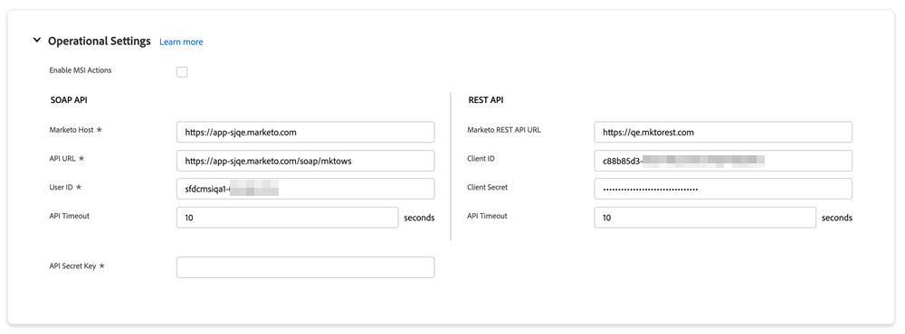

# Salesforce의 Marketo Sales Insight 구성 탭 {#marketo-sales-insight-configuration-tab-in-salesforce}

## 작업 설정 {#operational-settings}

SFDC에서 Sales Insight를 사용하려면 이 설정을 해야 합니다.

* MSI에서는 Soap와 Rest API를 모두 사용합니다
* Marketo 계정의 Sales Insight 페이지에는 Soap 및 Rest API 자격 증명이 있는 두 개의 해당 패널이 있으며 이 패널은 복사하여 여기에 붙여넣을 수 있습니다
* Soap 및 Rest API에는 조직의 요구 사항에 따라 설정할 수 있는 별도의 시간 초과가 있습니다. 허용되는 최대 시간은 120초입니다
* 인사이트 대시보드 비활성화: Rest API 자격 증명을 제거하고 Soap API만 사용할 수 있습니다. 이렇게 하면 모든 MSI 시각력 패널에서 통찰력 대시보드 탭이 비활성화됩니다

## MSI 구성 {#msi-configuration}

구성은 모든 MSI 사용자에게 적용할 수 있으며 프로필에만 적용할 수 없습니다.

**Visualforce 페이지 설정**

* 작업 활성화 드롭다운:
   * Lead 및 Contact MSI 레이아웃에서 Marketo 이메일 전송 드롭다운에서 숨기기 기능
   * 리드의 드롭다운에서 Marketo Campaign에 추가 옵션을 숨기고 MSI 레이아웃에 연결
* 예정된 이벤트: 초대된 이벤트, 모든 이벤트를 사용자에게 표시하거나 이 탭을 완전히 숨길 수 있는 기능
* 예정된 캠페인: 모든 이메일 캠페인을 표시하거나 이 탭을 완전히 숨기는 기능
* 예정된 캠페인 및 이벤트 로드: 온디맨드 &quot;예정된 항목 로드&quot; 단추 뒤에 이벤트 및 캠페인 탭을 배치하여 사용자가 수행하는 Rest API 호출 수를 줄이는 기능
* 탭 설정: 기본적으로 5개의 탭을 모두 사용할 수 있습니다. Sales Insight 패널에서 탭 순서를 선택할 수 있습니다. 모든 레이아웃(리드, 연락처, 계정, 기회)에 동일한 주문이 적용됩니다.

**Marketo 전역 탭**

* RSS 피드 사용: 사용하도록 설정하면 MSI 사용자는 RSS 피드에서 리드 피드를 볼 수 있습니다(Salesforce의 리드 피드 외에도). RSS 피드는 &quot;토큰 만료&quot; 기능이 비활성화된 경우에만 작동할 수 있습니다. 이 설정은 Marketo Sales Insight Admin 페이지에서 제어합니다.
* 최상의 디버그 모드
* 기본 숨기기: 여기에서 선택하는 옵션은 &quot;숨기기&quot; 아이콘을 클릭하면 Marketo의 가장 좋은 선택 탭에 가장 잘 노출되는 일 수가 됩니다
* 연락처 상태 필드: 여기서 선택하는 옵션은 Marketo의 가장 좋은 선택 탭에 있는 상태 헤더 열에 채워진 값이 됩니다
* 라이브 피드 설정: 라이브 피드(리드, 연락처, 계정 및 기회 패널, 글로벌 Marketo 페이지)만 표시하거나, 리드 피드(Marketo 글로벌 페이지에서)만 표시하거나 라이브 및 리드 피드를 모두 표시하도록 선택하는 옵션입니다
* 탭 설정: 기본적으로 5개의 탭을 모두 사용할 수 있습니다. Marketo 글로벌 페이지에서 탭 순서를 선택할 수 있습니다

**제한**

* 활동(흥미로운 순간, 웹 활동, 이메일)은 기본적으로 1000으로 설정됩니다. 이메일 캠페인 및 이벤트는 기본적으로 200으로 설정됩니다
* 조직의 시간 초과 문제가 발생하는 경우 제한을 줄일 수 있습니다

**작업 설정**

* Marketo 이메일 보내기: 이를 활성화하면 모든 Sales Insight 사용자가 리드, 연락처, 계정, 기회 패널 및 최상의 선택 탭(벌크 작업 및 인라인 참여)에서 이메일을 보낼 수 있습니다
* Marketo Campaign에 추가: 이를 활성화하면 모든 Sales Insight 사용자가 리드, 연락처, 계정, 기회 패널 및 최상의 선택 탭(벌크 작업 및 인라인 참여)의 캠페인에 추가할 수 있습니다

## Marketo Sales Insight 재설정 {#reset-marketo-sales-insight}

이렇게 선택하면 SFDC에서 모든 구성이 지워지고 복원할 수 없습니다. 모든 것을 다시 구성해야 합니다.

>[!IMPORTANT]
>
>Sales Insights 작업 기능을 사용하지 않는 경우 &quot;MSI 작업 활성화&quot; 확인란을 선택하지 마십시오.

>[!MORELIKETHIS]
>
>[프로필에 Sales Insight Access 추가](/help/marketo/product-docs/marketo-sales-insight/msi-for-salesforce/configuration/add-sales-insight-access-to-profiles.md){target=&quot;_blank&quot;}
