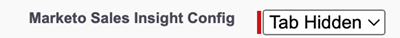

# Sales Insight Access 제거 {#remove-sales-insight-access}

Salesforce에서 Sales Insight 기능에 대한 액세스를 제거하려면 다음 단계를 수행합니다. Salesforce Classic 및 Lightning에 적용됩니다.

## 개요 {#overview}

모든 Sales Insight 기능에 액세스하려면 아래에 언급된 개체, Apex 클래스 및 Visualforce 페이지에 대한 권한이 필요합니다. 이러한 기능을 제거하면 Sales Insight에 대한 액세스가 제거됩니다.

**개체 설정**

<table> 
 <tbody> 
 <tr> 
   <td>BestBetsCache</td> 
   <td>읽기, 만들기, 편집, 삭제, 모두 보기, 모두 수정</td> 
  </tr> 
  <tr> 
   <td>최상의 보기 세부 정보</td> 
   <td>읽기, 만들기, 편집, 삭제, 모두 보기, 모두 수정</td> 
  </tr> 
  <tr> 
   <td>최고의 보기</td> 
   <td>읽기, 만들기, 편집, 삭제, 모두 보기, 모두 수정</td> 
  </tr> 
  <tr> 
   <td>EmailActivityCache</td> 
   <td>읽기, 만들기, 편집, 삭제, 모두 보기, 모두 수정</td> 
  </tr> 
  <tr> 
   <td>GetMethodArgus</td> 
   <td>읽기, 만들기, 편집, 삭제, 모두 보기, 모두 수정</td> 
  </tr> 
  <tr> 
   <td>GroupedWebActivityCache</td> 
   <td>읽기, 만들기, 편집, 삭제, 모두 보기, 모두 수정</td> 
  </tr> 
  <tr> 
   <td>InterestMomentsCache</td> 
   <td>읽기, 만들기, 편집, 삭제, 모두 보기, 모두 수정</td> 
  </tr> 
  <tr> 
   <td>Marketo Sales Insight Config</td> 
   <td>읽기, 만들기, 편집, 삭제, 모두 보기, 모두 수정</td> 
  </tr> 
  <tr> 
   <td>ScoringCache</td> 
   <td>읽기, 만들기, 편집, 삭제, 모두 보기, 모두 수정</td> 
  </tr> 
  <tr> 
   <td>값</td> 
   <td>읽기, 만들기, 편집, 삭제, 모두 보기, 모두 수정</td> 
  </tr> 
  <tr> 
   <td>WebActivityCache</td> 
   <td>읽기, 만들기, 편집, 삭제, 모두 보기, 모두 수정</td> 
  </tr> 
 </tbody> 
</table>

* Apex 클래스 액세스: 159 &quot;mkto_si&quot;로 시작하는 Apex 클래스
* Visualforce 페이지 액세스: 64 &quot;mkto_si&quot;로 시작하는 시각화 강제 페이지
* 사용자 지정 설정 정의: mkto_si.Marketo 설정 및 mkto_si.User 환경 설정

## Sales Insight에 대한 액세스 제거 {#removing-access-to-sales-insight}

1. Salesforce 계정에 로그인합니다.

1. 클릭 **설정**.

   

1. 관리자(Administrator)에서 **사용자 관리**, 그런 다음 **프로필**.

1. 업데이트할 프로필을 클릭한 다음 **편집**.

1. 탭 설정 아래의 &quot;사용자 지정 탭 설정&quot;으로 아래로 스크롤합니다.

1. Marketo Sales Insight Config 및 MSI Marketo Sales Outbox의 드롭다운에서 &quot;Tab Hidden&quot; 옵션을 선택합니다.

   

   

1. 아래로 스크롤하여 &quot;사용자 지정 개체 권한&quot;으로 이동합니다.

1. 다음 객체에서 &quot;읽기, 생성, 편집, 삭제&quot; 액세스를 제거합니다.

   * BestBetsCache
   * 최상의 보기 세부 정보
   * 최고의 보기
   * EmailActivityCache
   * GetMethodArgus
   * GroupedWebActivityCache
   * InterestMomentsCache
   * Marketo Sales Insight Config
   * ScoringCache
   * 값
   * WebActivityCache

1. &quot;Enabled Apex Class Access&quot; 섹션으로 스크롤합니다. 클릭 **편집**.

1. &quot;Enabled Apex 클래스&quot; 섹션에서 &quot;mkto_si&quot;로 시작하는 모든 클래스를 선택합니다. 이 경우 최대 159개의 클래스가 추가됩니다.

1. 클릭 **제거**, 그런 다음 **저장**.

   

1. &quot;Enabled Visualforce Page Access&quot; 섹션으로 스크롤합니다. 클릭 **편집**.

1. &quot;Enabled Visualforce Pages&quot; 섹션에서 &quot;mkto_si&quot;로 시작하는 모든 페이지를 선택합니다. 최대 64페이지가 추가됩니다.

1. 클릭 **제거**, 그런 다음 **저장**.

   

1. &quot;Enabled Custom Setting Definitions Access&quot; 섹션으로 스크롤합니다. 클릭 **편집**.

1. Marketo Sales Insight.mkto_si.Marketo Settings 와 &quot;Marketo Sales Insight.mkto_si.User Preferences&quot;를 선택합니다.

1. 클릭 **제거**, 그런 다음 **저장**.

   

됐습니다. Sales Insight 액세스를 제거했습니다. 액세스를 제거할 다른 프로필에 대해 동일한 단계를 반복합니다.
