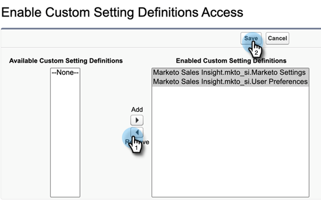

# Sales Insight 액세스 제거 {#remove-sales-insight-access}

다음 단계를 사용하여 Salesforce의 Sales Insight 기능에 대한 액세스를 제거하십시오. Salesforce Classic 및 Lightning에 적용됩니다.

## 개요 {#overview}

모든 Sales Insight 기능에 액세스하려면 아래 언급된 객체, Apex 클래스 및 visualforce 페이지에 대한 권한이 필요합니다. 이 항목을 제거하면 Sales Insight에 대한 액세스 권한이 제거됩니다.

**개체 설정**

<table> 
 <tbody> 
 <tr> 
   <td>BestBetsCache</td> 
   <td>읽기, 만들기, 편집, 삭제, 모두 보기, 모두 수정</td> 
  </tr> 
  <tr> 
   <td>세부 정보 보기 모범 사례</td> 
   <td>읽기, 만들기, 편집, 삭제, 모두 보기, 모두 수정</td> 
  </tr> 
  <tr> 
   <td>최상의 선택 보기</td> 
   <td>읽기, 만들기, 편집, 삭제, 모두 보기, 모두 수정</td> 
  </tr> 
  <tr> 
   <td>EmailActivityCache</td> 
   <td>읽기, 만들기, 편집, 삭제, 모두 보기, 모두 수정</td> 
  </tr> 
  <tr> 
   <td>GetMethodArgus</td> 
   <td>읽기, 만들기, 편집, 삭제, 모두 보기, 모두 수정</td> 
  </tr> 
  <tr> 
   <td>그룹화된 웹 활동 캐시</td> 
   <td>읽기, 만들기, 편집, 삭제, 모두 보기, 모두 수정</td> 
  </tr> 
  <tr> 
   <td>InterestingMomentsCache</td> 
   <td>읽기, 만들기, 편집, 삭제, 모두 보기, 모두 수정</td> 
  </tr> 
  <tr> 
   <td>Marketo Sales Insight 구성</td> 
   <td>읽기, 만들기, 편집, 삭제, 모두 보기, 모두 수정</td> 
  </tr> 
  <tr> 
   <td>ScoringCache</td> 
   <td>읽기, 만들기, 편집, 삭제, 모두 보기, 모두 수정</td> 
  </tr> 
  <tr> 
   <td>값</td> 
   <td>읽기, 만들기, 편집, 삭제, 모두 보기, 모두 수정</td> 
  </tr> 
  <tr> 
   <td>WebActivityCache</td> 
   <td>읽기, 만들기, 편집, 삭제, 모두 보기, 모두 수정</td> 
  </tr> 
 </tbody> 
</table>

* Apex 클래스 액세스: &quot;mkto_si&quot;로 시작하는 159개의 Apex 클래스
* Visualforce 페이지 액세스: &quot;mkto_si&quot;로 시작하는 64개의 Visualforce 페이지
* 사용자 정의 설정 정의: mkto_si.Marketo 설정 및 mkto_si.사용자 환경 설정

## Sales Insight 액세스 제거 {#removing-access-to-sales-insight}

1. Salesforce 계정에 로그인합니다.

1. **설치**&#x200B;를 클릭합니다.

   

1. 관리자 아래에서 **사용자 관리**&#x200B;를 클릭한 다음 **프로필**&#x200B;을 클릭합니다.

1. 업데이트할 프로필을 클릭한 다음 **편집**&#x200B;을 클릭합니다.

1. 탭 설정 아래의 &quot;사용자 정의 탭 설정&quot;으로 스크롤합니다.

1. Marketo Sales Insight Config 및 MSI Marketo Sales Outbox에 대한 드롭다운에서 &quot;Tab Hidden&quot; 옵션을 선택합니다.

   

   

1. 아래로 스크롤하여 &quot;사용자 지정 객체 권한&quot;을 선택합니다.

1. 다음 오브젝트에서 &quot;읽기, 만들기, 편집, 삭제&quot; 액세스 제거:

   * BestBetsCache
   * 세부 정보 보기 모범 사례
   * 최상의 선택 보기
   * EmailActivityCache
   * GetMethodArgus
   * 그룹화된 웹 활동 캐시
   * InterestingMomentsCache
   * Marketo Sales Insight 구성
   * ScoringCache
   * 값
   * WebActivityCache

1. &quot;Enabled Apex Class Access&quot; 섹션으로 스크롤합니다. **편집**&#x200B;을 클릭합니다.

1. &quot;Enabled Apex Classes&quot; 섹션에서 &quot;mkto_si&quot;로 시작하는 모든 클래스를 선택합니다. 최대 159개의 클래스가 추가되어야 합니다.

1. **제거**&#x200B;를 클릭한 다음 **저장**&#x200B;을 클릭합니다.

   

1. 아래로 스크롤하여 &quot;Visualforce 페이지 액세스 활성화&quot; 섹션으로 이동합니다. **편집**&#x200B;을 클릭합니다.

1. &quot;Visualforce 페이지 활성화&quot; 섹션에서 &quot;mkto_si&quot;로 시작하는 모든 페이지를 선택합니다. 최대 64페이지까지 추가할 수 있습니다.

1. **제거**&#x200B;를 클릭한 다음 **저장**&#x200B;을 클릭합니다.

   

1. &quot;사용자 정의 설정 정의 액세스 활성화&quot; 섹션으로 스크롤합니다. **편집**&#x200B;을 클릭합니다.

1. &quot;Marketo Sales Insight.mkto_si.Marketo 설정&quot; 및 &quot;Marketo Sales Insight.mkto_si.User 환경 설정&quot;을 선택합니다.

1. **제거**&#x200B;를 클릭한 다음 **저장**&#x200B;을 클릭합니다.

   

됐습니다. Sales Insight 액세스를 정상적으로 제거했습니다. 액세스 권한을 제거하려는 다른 프로필에 대해서도 동일한 단계를 반복합니다.
