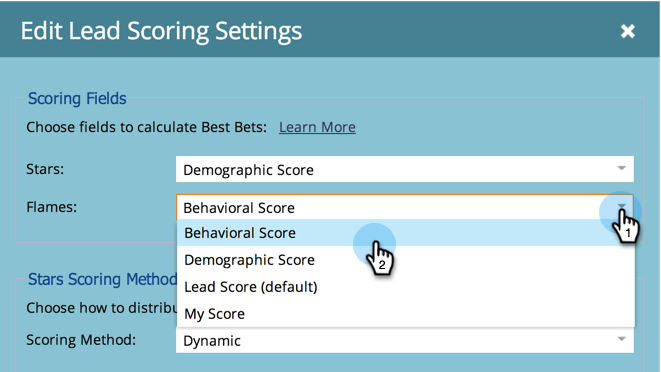

# Marketo 관리자를 위한 Sales Insight Page {#sales-insight-page-for-marketo-admins}

Marketo 관리자는 Sales Insight에서 특정 권한을 갖습니다. 아래에 나와 있는 내용을 알아봅니다.

## Soap API 구성 {#soap-api-configuration}

이러한 자격 증명은 Salesforce에서 MSI를 사용하기 위해 Salesforce 계정을 Marketo 인스턴스에 연결하는 데 사용됩니다.

## Rest API 구성 {#rest-api-configuration}

이러한 자격 증명은 Salesforce에서 MSI 통찰력 대시보드를 사용하기 위해 Salesforce 계정을 Marketo 인스턴스에 연결하는 데 사용됩니다.

## 개인 점수 설정 {#person-score-settings}

* **별**: 별은 다른 리드에 비해 총 리드 점수를 나타냅니다.
* **불꽃**: 불길은 급박함을 나타낸다.

기본적으로 Marketo Sales Insight는 리드 점수 필드를 사용하여 별과 화염을 계산합니다. 그러나 다른 필드를 선택하려면 다음과 같이 하십시오.

1. 에서 **관리** Marketo 영역에서 **Sales Insight**.

   

1. 리드 점수 설정에서 을 클릭합니다. **편집**.

   

1. 별에 사용할 필드를 선택합니다.

   

1. 화염에 사용할 필드를 선택합니다.

   

1. 클릭 **저장**. 판매 통찰력은 재계산하는 데 시간이 좀 걸릴 것입니다. 나중에 CRM에서 별과 화염을 확인할 수 있습니다.

   

   >[!TIP]
   >
   >사용자 지정 점수 필드가 없는 경우 다음과 같이 하십시오 [만들기](/help/marketo/product-docs/administration/field-management/create-a-custom-field-in-marketo.md).

   >[!MORELIKETHIS]
   >
   >[별과 불꽃](/help/marketo/product-docs/marketo-sales-insight/msi-for-salesforce/features/stars-and-flames/customize-stars-and-flames.md)

## 설정 {#settings}

**설정 가입 해지:**

템플릿 없음, 표준 이메일 및 운영 이메일에 대한 다음 가입 해지 설정 중에서 선택할 수 있습니다

* 가입 해지 설정 준수
* 수신자가 1명 이상인 경우 가입 해지 설정을 준수합니다.
* 수신자가 5명 이상인 경우 가입 해지 설정 준수
* 가입 해지 설정 무시

**템플릿 잠금 기능 사용:**

사용하도록 설정하면 MSI 사용자는 Salesforce에서 전자 메일을 보내는 동안 템플릿을 편집할 수 없습니다

**RSS 피드 사용:**

사용하도록 설정하면 MSI 사용자는 RSS 피드에서 리드 피드를 볼 수 있습니다(Salesforce의 리드 피드 외에도). RSS 피드는 &quot;토큰 만료&quot; 기능이 비활성화된 경우에만 작동할 수 있습니다.

**토큰 만료:**

토큰 만료는 기능 관리자에서 제어됩니다. 이 기능을 활성화/비활성화하려면 다음 주소로 문의하십시오 [Marketo 지원](https://nation.marketo.com/t5/Support/ct-p/Support). 활성화되면 모든 Marketo 토큰이 10분 이내에 만료됩니다. 비활성화하면 Marketo 토큰이 만료되지 않습니다.

토큰 만료를 활성화하기 전에 생성된 토큰은 유효성을 검사할 만료 시간이 없으므로 이 기능이 현재 활성화되어 있어도 만료되지 않습니다.

토큰 만료를 활성화한 후 생성된 토큰은 만료 시간이 10분이므로 기능이 비활성화된 후에도 10분 후에 만료됩니다.

토큰 동작은 생성 시점을 기준으로 합니다(토큰 만료 기능이 현재 기능 상태가 아니라 활성화/비활성화되었을 때).
