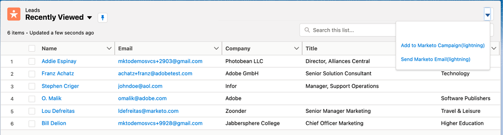

# [!DNL Sales Insight]에서 동작 선택 {#choose-an-action-in-sales-insight}

[!DNL Sales Insight] Classic 및 Lightning의 [!DNL Salesforce] 드롭다운에서 다음 작업을 사용할 수 있습니다.

* Marketo 이메일 보내기
* Marketo 캠페인에 추가
* 감시 목록에 추가

이러한 각 기능은 다음 위치에서 액세스할 수 있습니다.

**단일 액션이 있는 페이지 레이아웃**

* 리드 레이아웃 패널: 단일 작업 및 사용자 프로필로 제어 가능
* 연락처 레이아웃 패널: 단일 작업으로 사용자 프로필로 제어할 수 있음
* 가망 고객 레이아웃 단추: 단일 작업으로 사용자 프로필로 제어할 수 없음
* 연락처 레이아웃 단추: 단일 작업으로 사용자 프로필로 제어할 수 없음

  

**그룹 동작이 있는 페이지 레이아웃**

* 계정 레이아웃 패널: 그룹 작업 및 사용자 프로필로 제어 가능
* 영업 기회 레이아웃 패널: 그룹 작업 및 사용자 프로필로 제어 가능

  

**[!DNL Best Bets]탭**

* [!DNL Best Bets] 일괄 작업 탭: 그룹 작업이며 사용자 프로필로 제어할 수 있습니다.

  

* [!DNL Best Bets] 인라인 작업 탭: 단일 작업이며 사용자 프로필로 제어할 수 있습니다.

  

**일괄 작업이 있는 목록 보기**

* 가망 고객 목록 보기: 대량 작업이며 사용자 프로필로 제어할 수 없음
* 연락처 목록 보기: 대량 작업이며 사용자 프로필로 제어할 수 없음

  
