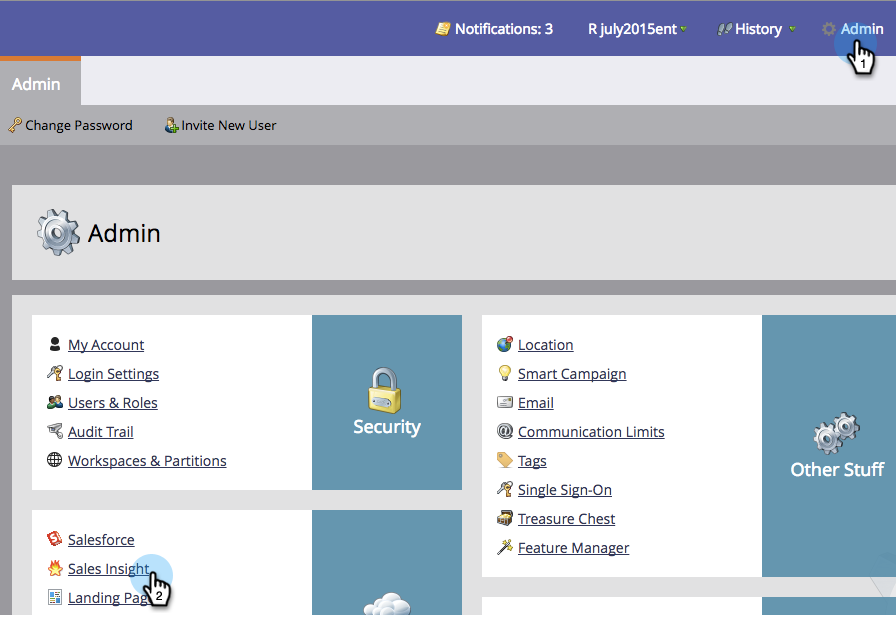
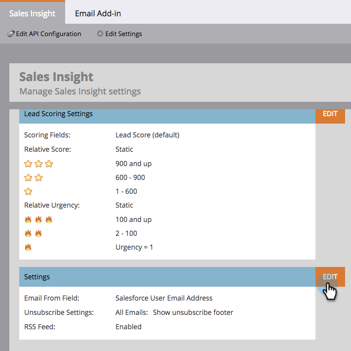

# 영업 템플릿 잠금 {#lock-sales-template}

CRM 사용자가 판매 템플릿을 편집하지 못하도록 하기 위해 관리자는 템플릿을 잠글 수 있도록 설정할 수 있으며, 이를 통해 사용자는 이메일 편집기에서 템플릿을 개별적으로 잠글 수 있습니다.

>[!CAUTION]
>
>이 기능은 Salesforce에서만 작동하며 Microsoft Dynamics 또는 다른 CRM과 호환되지 않습니다. 편집기는 Marketing To에서 제어하지 않으므로 Outlook 또는 Gmail 플러그인에서 액세스하는 템플릿은 잠기지 않습니다.

## 템플릿 잠금 활성화 {#enable-lock-template}

>[!NOTE]
>
>**관리자 권한 필요**

1. **관리**&#x200B;로 이동한 다음 **영업 인사이트**&#x200B;를 클릭합니다.

   

1. **설정**&#x200B;에서 **편집**&#x200B;을 클릭합니다.

   

1. **템플릿 잠금 기능 활성화**&#x200B;을 선택합니다. **저장**&#x200B;을 클릭합니다.

   

>[!NOTE]
>
>기본적으로 이 상자가 선택되고 템플릿 잠금 기능이 활성화됩니다. 선택을 취소하면 이메일 편집기에서 템플릿 잠금 기능이 비활성화됩니다.

>[!NOTE]
>
>이 설정을 관리자로 변경하면 **은(는) 기존 템플릿에 소급 적용되지 않습니다.즉, 자동으로 잠기지 않습니다.**

## 이메일 편집기에서 템플릿 잠금{#lock-template-in-the-email-editor}

1. 잠글 이메일을 선택한 다음 **초안 편집**&#x200B;을 클릭합니다.

   

1. 이메일 편집기에서 **이메일 설정**&#x200B;을 클릭합니다.

   

1. 아직 확인되지 않은 경우 **Marketing to Sales Insight**&#x200B;에 게시를 선택합니다. 이제 템플릿을 잠그려면 **CRM 사용자가 이메일**&#x200B;을 편집할 수 있도록 허용의 선택을 취소할 수 있습니다. **저장**&#x200B;을 클릭합니다.

   

   >[!NOTE]
   >
   >기본적으로 이 상자가 선택되어 있고 CRM 사용자가 이메일을 편집할 수 있습니다.

