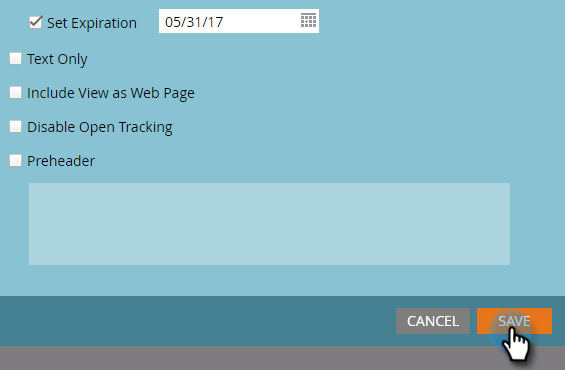

# 영업 인사이트에 이메일 게시 {#publish-an-email-to-sales-insight}

Sales Insight에 게시 설정을 활성화하면 Outlook 및 Gmail Add-In뿐만 아니라 Sales Insight에서 영업 팀이 이메일을 사용할 수 있게 됩니다. 만료 날짜를 지정할 수도 있습니다.

1. 이메일을 찾아 선택한 다음 초안 **편집을 클릭합니다**.

   

1. 편집기가 열리면 [ **이메일 설정]을 클릭합니다**.

   

1. Marketing **to Sales Insight에 게시를 선택합니다**.

   

1. 만료 날짜(선택 사항)를 설정하려면 만료 **설정을** 선택하고 날짜를 선택합니다.

   

   >[!NOTE]
   >
   >오후 11시 59분에(CST) 만료 날짜(설정한 경우)에 사용 가능하도록 한 이메일은 Sales Insight와 해당 추가 기능에서 사라집니다. 물론 Marketing Cloud에서 액세스할 수 있습니다.

1. 저장을 **클릭합니다**.

   

잘했어! 이제 세일즈 팀이 CRM에서 보낼 수 있는 이메일을 만들고 필요한 경우 사용 가능한 시간을 제한하는 방법을 알 수 있습니다.

>[!NOTE]
>
>[Microsoft Dynamics 또는 Salesforce에서 Sales Insight로 이메일을 보낼 때 내 토큰은](../../../../../../product-docs/core-marketo-concepts/programs/tokens/understanding-my-tokens-in-a-program.md) 확인되지 않습니다.표준 토큰만 채워집니다(리드, 회사 등). 그러나 토큰의 기본값은 작동합니다.

>[!TIP]
>
>변경 사항을 적용하려면 이 이메일을 승인해야 합니다. 이메일 [승인 방법을 알아봅니다](../../../../../../product-docs/email-marketing/general/creating-an-email/approve-an-email.md).

