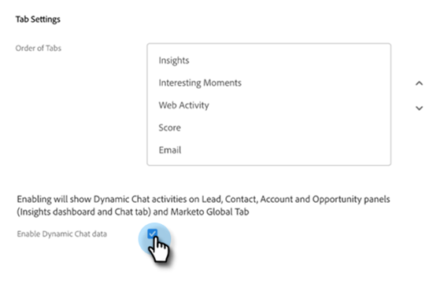

# Dynamic Chat 통합 {#dynamic-chat-integration}

Sales Insight과 Dynamic Chat 통합에 대해 자세히 알아보십시오.

>[!PREREQUISITES]
>
>* Sales Insight SFDC 패키지 버전은 [2.4.0 이상이어야 합니다](/help/marketo/product-docs/marketo-sales-insight/msi-for-salesforce/upgrading/upgrading-your-msi-package.md){target="_blank"}
>
>* [Dynamic Chat 통합](/help/marketo/product-docs/demand-generation/dynamic-chat/dynamic-chat-overview.md){target="_blank"}을 설정해야 합니다.
>
>* Sales Insight [작업 설정](/help/marketo/product-docs/marketo-sales-insight/msi-for-salesforce/configuration/marketo-sales-insight-configuration-tab-in-salesforce.md#operational-settings){target="_blank"}에서 &quot;API 비밀 키&quot; 필드가 채워져 있는지 확인하십시오. 검색하지 못한 경우 [여기](/help/marketo/product-docs/marketo-sales-insight/msi-for-salesforce/configuration/configure-marketo-sales-insight-in-salesforce-enterprise-unlimited.md#configure-sales-insight-in-marketo){target="_blank"}에서 검색하는 방법을 알아보세요.

## [!DNL Marketo Sales Insight] 구성 탭 {#marketo-sales-insight-configuration-tab}

[!DNL Dynamic Chat] 통합을 사용하려면 아래 단계를 따르십시오.

1. [!DNL Salesforce] 계정에 로그인하고 탭 표시줄의 끝에 있는 +를 클릭한 다음 **[!DNL Marketo Sales Insight Config]**&#x200B;을(를) 클릭합니다.

1. &quot;[!UICONTROL Visualforce Panel]&quot;을(를) 펼치려면 클릭하십시오.

   

1. **[!UICONTROL Enable Dynamic Chat Data]** 확인란을 선택합니다.

   

## 기능 개요 {#feature-overview}

[!DNL Dynamic Chat] 사용자가 다음 [!DNL Sales Insight] 활동을 활용할 수 있습니다.

참여 대화 상자: 방문자가 챗봇을 클릭하고 대화 상자에 참여하면 Marketo에 로그인되고 [!DNL Sales Insight]에 채워집니다.

* 대화 상자 이름
* 페이지 URL
* 상태(시작됨/삭제됨/완료됨)

예약된 약속: 방문자가 챗봇을 통해 약속을 예약하면 Marketo에 로그인되고 [!DNL Sales Insight]에 채워집니다.

* 대화 상자 이름
* 에이전트
* 페이지 URL
* 예약 날짜(날짜 및 타임스탬프 삽입)
* 상태(예약됨, 다시 예약됨, 취소됨)

목표 도달: Marketo에 로그인하고 방문자가 모든 대화 상자 흐름의 목표에 도달하면 [!DNL Sales Insight]에 채워집니다.

* 대화 상자 이름
* 목표 이름
* 페이지 URL

Document와 상호 작용: 방문자가 챗봇을 통해 공유된 문서와 상호 작용할 때 Marketo에 로그인되고 [!DNL Sales Insight]에 채워집니다.

* 대화 상자 이름
* 문서
* 상태

채팅 활동은 Insights 대시보드에서 사용할 수 있습니다.

채팅 탭은 리드 및 연락처 패널에서 사용할 수 있습니다. 여기에는 [!UICONTROL Activity Type], [!UICONTROL Dialogue Name] 및 [!UICONTROL Date] 열이 포함됩니다.

활동 유형을 클릭하면 해당 유형에 대해 자세히 알아볼 수 있습니다.

마찬가지로 [계정] 및 [영업 기회] 패널에는 [!UICONTROL Name], [!UICONTROL Activity Type], [!UICONTROL Dialogue Name] 및 [!UICONTROL Date] 열이 있습니다.

채팅 탭은 글로벌 Marketo 탭에도 포함되어 있습니다. 여기에는 다음 열과 함께 세 가지 활동 유형([!UICONTROL Engaged Dialogue], [!UICONTROL Scheduled Appointment], [!UICONTROL Reached Goal])이 포함됩니다.

* [!UICONTROL Person]
* [!UICONTROL Account]
* [!UICONTROL Activity type]&#x200B;([!UICONTROL Engaged Dialogue], [!UICONTROL Scheduled Appointment], [!UICONTROL Reached Goal])
* [!UICONTROL Dialogue Name]
* [!UICONTROL Date]

활동 유형을 클릭하면 해당 유형에 대해 자세히 알아볼 수 있습니다.

>[!NOTE]
>
>&quot;[!UICONTROL Enable Dynamic Chat data]&quot; 확인란이 비활성화되면 다음 기능이 비활성화됩니다.
>
>* 인사이트 대시보드의 채팅 활동이 있는 행(스마트 그리드 및 주간 목록 보기)
>* 잠재 고객, 연락처, 계정 및 영업 기회 패널의 채팅 탭
>* 글로벌 Marketo 탭의 채팅 탭
>
>이러한 기능 중 하나만 비활성화할 수는 없습니다.
