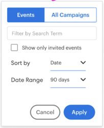

# Insights 대시보드 기능 개요 {#insights-dashboard-feature-overview}

[!DNL Sales Insights] 대시보드에서 사용할 수 있는 기능에 대해 자세히 알아보세요.

>[!PREREQUISITES]
>
>최신 MSI SFDC 패키지 및 [구성](/help/marketo/product-docs/marketo-sales-insight/msi-for-salesforce/configuration/configuration-for-existing-customers.md)이 있어야 합니다.

## 연락처 레이아웃 {#contact-layout}

**참여 속도 눈금**

* 이 스마트 그리드에는 지난 90일 동안의 관심 있는 순간, 이메일 및 웹 활동이 포함됩니다
* 사용자는 &quot;[!UICONTROL Show Account]&quot; 활동을 선택할 수 있습니다. 이렇게 하면 연락처 보기에 모든 계정 수준의 관심 있는 순간, 전자 메일 및 웹 활동이 계층화됩니다.
* 특정 주를 강조 표시하여 해당 주 내에 활동을 볼 수 있습니다.
* 기본 보기: 현재 주가 선택됨

**참여 드릴다운 및 요약**

* 재미있는 순간, 이메일 및 웹 활동에 대한 활동 카드 드릴다운
* Interest Moments 활동 카드 - 가입 옵션 포함
* 이메일 활동 카드 - 미리 보기 옵션 포함
* 웹 활동 카드 - 링크를 클릭하는 기능이 포함되어 있습니다.
* 주별 요약 표시줄에는 해당 주의 흥미로운 순간, 이메일 및 웹 활동이 표시됩니다. 각 아이콘은 클릭 가능하며 특정 활동을 표시하는 필터로 사용할 수 있습니다
* 기본 보기: 현재 보기의 활동 목록입니다

**예정된 이메일 캠페인 및 이벤트**

이메일 캠페인 탭:

* 향후 90일 이내에 예정된 이메일 프로그램 또는 기본 프로그램의 일부인 캠페인을 포함합니다
* 연락처/잠재 고객에만 국한되지 않습니다(즉, 캠페인 목록은 Marketo 인스턴스에서 예약된 모든 이메일 캠페인의 일반 목록입니다). 모든 리드, 연락처, 계정 및 영업 기회 패널의 캠페인 목록은 동일합니다
* 캠페인 반복이 향후 90일 동안 3회 이상 실행되는 경우 특정 시점에 다음 3회의 실행만 표시됩니다(Marketo의 동작과 유사)
* 이 섹션의 활동 세부 사항 카드에는 미리 보기 옵션이 있습니다. 흐름에 여러 개의 이메일 전송 단계가 포함된 경우 모든 이메일을 미리 볼 수 있습니다. 이메일 흐름 전송 단계 내에서 &quot;이메일 선택 사항&quot;이 여러 개 있는 경우 기본 옵션을 미리 볼 수 있습니다
* 필터에는 &quot;[!UICONTROL Search]&quot; 및 &quot;[!UICONTROL Date Range]&quot;이(가) 포함됩니다.

이벤트 탭:

* 향후 90일 이내에 예약된 이벤트 프로그램 포함
* 필터 옵션을 사용하여 모든 이벤트/초대된 이벤트 보기(관리자 설정 기반)
* 초대된 이벤트를 선택하면 구성원 상태와 함께 특정 연락처가 초대된 이벤트가 표시됩니다
* 모든 이벤트를 선택하면 향후 90일 이내에 예약된 이벤트 목록이 표시됩니다
* 이 섹션의 활동 세부 사항 카드에 미리 보기 옵션이 있음
* 필터에는 &quot;[!UICONTROL Search]&quot;, &quot;[!UICONTROL Show only invited events]&quot; 및 &quot;[!UICONTROL Date Range]&quot;이(가) 포함됩니다.

## 잠재 고객 레이아웃 {#lead-layout}

**참여 속도 눈금**

* 이 스마트 그리드에는 지난 90일 동안의 관심 있는 순간, 이메일 및 웹 활동이 포함됩니다
* 특정 주를 강조 표시하여 해당 주 내에 활동을 볼 수 있습니다.
* 기본 보기: 현재 주가 선택됨
* &quot;[!UICONTROL Show Account Activity]&quot; 기능은 연락처로 전환될 때까지 [!DNL Salesforce]의 계정에 속하지 않으므로 잠재 고객에서 사용할 수 없습니다.

**참여 드릴다운 및 요약**

* 재미있는 순간, 이메일 및 웹 활동에 대한 활동 카드 드릴다운
* Interest Moments 활동 카드 - 가입 옵션 포함
* 이메일 활동 카드 - 미리 보기 옵션 포함
* 웹 활동 카드 - 링크를 클릭하는 기능이 포함되어 있습니다.
* 주별 요약 표시줄에는 해당 주의 흥미로운 순간, 이메일 및 웹 활동이 표시됩니다. 각 아이콘은 클릭 가능하며 특정 활동을 표시하는 필터로 사용할 수 있습니다
* 기본 보기: 현재 보기의 활동 목록입니다

**예정된 전자 메일 캠페인 및 이벤트:**

이메일 캠페인 탭:

* 향후 90일 이내에 예정된 이메일 프로그램 또는 기본 프로그램의 일부인 캠페인을 포함합니다
* 연락처/잠재 고객에만 국한되지 않습니다(즉, 캠페인 목록은 Marketo 인스턴스에서 예약된 모든 이메일 캠페인의 일반 목록입니다). 모든 리드, 연락처, 계정 및 영업 기회 패널의 캠페인 목록은 동일합니다
* 캠페인 반복이 향후 90일 동안 3회 이상 실행되는 경우 특정 시점에 다음 3회의 실행만 표시됩니다(Marketo의 동작과 유사)
* 이 섹션의 활동 세부 사항 카드에는 미리 보기 옵션이 있습니다. 흐름에 여러 개의 이메일 전송 단계가 포함된 경우 모든 이메일을 미리 볼 수 있습니다. 이메일 흐름 전송 단계 내에서 &quot;이메일 선택 사항&quot;이 여러 개 있는 경우 기본 옵션을 미리 볼 수 있습니다
* 필터에는 &quot;[!UICONTROL Search]&quot; 및 &quot;[!UICONTROL Date Range]&quot;이(가) 포함됩니다.

이벤트 탭:

* 향후 90일 이내에 예약된 이벤트 프로그램 포함
* 필터 옵션을 사용하여 모든 이벤트/초대된 이벤트 보기(관리자 설정 기반)
* 초대된 이벤트를 선택하면 구성원 상태와 함께 특정 연락처가 초대된 이벤트가 표시됩니다
* 모든 이벤트를 선택하면 향후 90일 이내에 예약된 이벤트 목록이 표시됩니다
* 이 섹션의 활동 세부 사항 카드에 미리 보기 옵션이 있음
* 필터에는 &quot;[!UICONTROL Search]&quot;, &quot;[!UICONTROL Show only invited events]&quot; 및 &quot;[!UICONTROL Date Range]&quot;이(가) 포함됩니다.

## 계정 레이아웃 {#account-layout}

**참여 속도 눈금**

* 이 스마트 그리드에는 계정의 모든 연락처에 대한 지난 90일 동안의 관심 있는 순간, 이메일 및 웹 활동이 포함됩니다
* 특정 주를 강조 표시하여 해당 주 내에 활동을 볼 수 있습니다.
* 기본 보기: 현재 주가 선택됨

**참여 드릴다운 및 요약**

* 연락처 이름을 포함하여 관심 있는 순간, 이메일 및 웹 활동에 대한 활동 카드 드릴다운
* Interest Moments 활동 카드 - 가입 옵션 포함
* 이메일 활동 카드 - 미리 보기 옵션 포함
* 웹 활동 카드 - 링크를 클릭하는 기능이 포함되어 있습니다.
* 주별 요약 표시줄에는 해당 주의 흥미로운 순간, 이메일 및 웹 활동이 표시됩니다. 각 아이콘은 클릭 가능하며 특정 활동을 표시하는 필터로 사용할 수 있습니다
* 기본 보기: 현재 보기의 활동 목록입니다

**예정된 이메일 캠페인 및 이벤트**

이메일 캠페인 탭:

* 향후 90일 이내에 예정된 이메일 프로그램 또는 기본 프로그램의 일부인 캠페인을 포함합니다
* 연락처/잠재 고객에만 국한되지 않습니다(즉, 캠페인 목록은 Marketo 인스턴스에서 예약된 모든 이메일 캠페인의 일반 목록입니다). 모든 리드, 연락처, 계정 및 영업 기회 패널의 캠페인 목록은 동일합니다
* 캠페인 반복이 향후 90일 동안 3회 이상 실행되는 경우 특정 시점에 다음 3회의 실행만 표시됩니다(Marketo의 동작과 유사)
* 이 섹션의 활동 세부 사항 카드에는 미리 보기 옵션이 있습니다. 흐름에 여러 개의 이메일 전송 단계가 포함된 경우 모든 이메일을 미리 볼 수 있습니다. 이메일 흐름 전송 단계 내에서 &quot;이메일 선택 사항&quot;이 여러 개 있는 경우 기본 옵션을 미리 볼 수 있습니다
* 필터에는 &quot;[!UICONTROL Search]&quot; 및 &quot;[!UICONTROL Date Range]&quot;이(가) 포함됩니다.

이벤트 탭:

* 향후 90일 이내에 예약된 이벤트 프로그램 포함
* 필터 옵션을 사용하여 모든 이벤트/초대된 이벤트 보기(관리자 설정 기반)
* 초대된 이벤트를 선택하면 구성원 상태와 함께 특정 연락처가 초대된 이벤트가 표시됩니다
* 모든 이벤트를 선택하면 향후 90일 이내에 예약된 이벤트 목록이 표시됩니다
* 이 섹션의 활동 세부 사항 카드에 미리 보기 옵션이 있음
* 필터에는 &quot;[!UICONTROL Search]&quot;, &quot;[!UICONTROL Show only invited events]&quot; 및 &quot;[!UICONTROL Date Range]&quot;이(가) 포함됩니다.

## 영업 기회 레이아웃 {#opportunity-layout}

**참여 속도 눈금**

* 이 스마트 그리드에는 Opportunity 의 모든 연락처에 대한 지난 90일 동안의 Interest Moment, Email 및 Web Activity 가 포함됩니다.
* 특정 주를 강조 표시하여 해당 주 내에 활동을 볼 수 있습니다.
* 기본 보기: 현재 주가 선택됨

**참여 드릴다운 및 요약**

* 연락처 이름을 포함하여 관심 있는 순간, 이메일 및 웹 활동에 대한 활동 카드 드릴다운
* Interest Moments 활동 카드 - 가입 옵션 포함
* 이메일 활동 카드 - 미리 보기 옵션 포함
* 웹 활동 카드 - 링크를 클릭하는 기능이 포함되어 있습니다.
* 주별 요약 표시줄에는 해당 주의 흥미로운 순간, 이메일 및 웹 활동이 표시됩니다. 각 아이콘은 클릭 가능하며 특정 활동을 표시하는 필터로 사용할 수 있습니다
* 기본 보기: 현재 보기의 활동 목록입니다

**예정된 이메일 캠페인 및 이벤트** 이메일 캠페인 탭:

* 향후 90일 이내에 예정된 이메일 프로그램 또는 기본 프로그램의 일부인 캠페인을 포함합니다
* 연락처/잠재 고객에만 국한되지 않습니다(즉, 캠페인 목록은 Marketo 인스턴스에서 예약된 모든 이메일 캠페인의 일반 목록입니다). 모든 리드, 연락처, 계정 및 영업 기회 패널의 캠페인 목록은 동일합니다
* 캠페인 반복이 향후 90일 동안 3회 이상 실행되는 경우 특정 시점에 다음 3회의 실행만 표시됩니다(Marketo의 동작과 유사)
* 이 섹션의 활동 세부 사항 카드에는 미리 보기 옵션이 있습니다. 흐름에 여러 개의 이메일 전송 단계가 포함된 경우 모든 이메일을 미리 볼 수 있습니다. 이메일 흐름 전송 단계 내에서 &quot;이메일 선택 사항&quot;이 여러 개 있는 경우 기본 옵션을 미리 볼 수 있습니다
* 필터에는 &quot;[!UICONTROL Search]&quot; 및 &quot;[!UICONTROL Date Range]&quot;이(가) 포함됩니다.

이벤트 탭:

* 향후 90일 이내에 예약된 이벤트 프로그램 포함
* 필터 옵션을 사용하여 모든 이벤트/초대된 이벤트 보기(관리자 설정 기반)
* 초대된 이벤트를 선택하면 구성원 상태와 함께 특정 연락처가 초대된 이벤트가 표시됩니다
* 모든 이벤트를 선택하면 향후 90일 이내에 예약된 이벤트 목록이 표시됩니다
* 이 섹션의 활동 세부 사항 카드에 미리 보기 옵션이 있음
* 필터에는 &quot;[!UICONTROL Search]&quot;, &quot;[!UICONTROL Show only invited events]&quot; 및 &quot;[!UICONTROL Date Range]&quot;이(가) 포함됩니다.

>[!NOTE]
>
>계정 또는 영업 기회에 800명이 넘는 연락처가 있는 경우 대시보드에 데이터가 표시되지 않습니다. 하지만 개별 연락처로 이동하여 해당 인사이트 및 참여를 확인할 수 있습니다. 계정에 연락처가 800개를 초과하는 경우 &quot;[!UICONTROL Show Account Level Activity]&quot;이(가) 비활성화됩니다.
