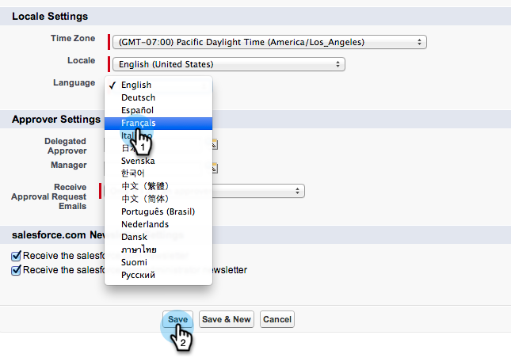

# Salesforce의 다양한 언어 지원을 위한 세일즈 인사이트 준비 {#prepare-sales-insight-for-multi-lingual-support-in-salesforce}

>[!NOTE]
>
>**관리자 권한 필요**

Marketing To Sales Insight는 언어별로 저장됩니다. 따라서 두 개 이상의 언어로 사용하려면 각 언어에 대해 자격 증명을 별도로 입력해야 합니다.

>[!NOTE]
>
>Sales Insight는 현재 다음과 같은 기능을 지원합니다.
>
>* 영어
>* 프랑스어
>* 독일어

>
>
다른 모든 언어는 기본적으로 영어로 설정됩니다.

1. Marketing to Sales Insight에 대한 새 언어 추가
1. Salesforce에 로그인합니다. 오른쪽 상단 모서리의 이름 아래에 있는 드롭다운에서 **설정을 클릭합니다**.

   

1. *** 내 개인 정보**에서 **개인 정보를 클릭합니다**.

   

1. 편집을 **클릭합니다**.

   

1. 언어를 선택하고 [저장]을 **클릭합니다**.

   

1. 이제 Salesforce 인터페이스가 선택한 언어로 제공됩니다. 사용 가능한 모든 탭을 보려면 **+** 아이콘을 클릭하면 됩니다.

   

1. **Marketing to Sales Insight **(선택한 언어)를 클릭합니다.

   

1. Marketing으로 이동합니다. Marketing [to Sales Insight **API 구성** 세부 정보를 찾습니다](https://docs.marketo.com/pages/viewpage.action?pageId=2360368#ConfigureMarketoSalesInsightinSalesforceEnterprise/Unlimited-ConfigureMarketoSalesInsight) .

   

1. Marketing에서 API 세부 사항을 입력하고 **저장을 클릭합니다**.

   

## Salesforce를 영어로 변경 {#change-salesforce-back-to-english}

Salesforce 조직의 맞춤화를 완료하면 개인 구성을 영어로 반환하는 방법을 설명합니다.

>[!NOTE]
>
>다음 스크린샷은 영어로 된 지침과 함께 프랑스어입니다.  이전 단계에서 선택한 언어의 텍스트가 동일한 화면이 표시됩니다.

1. 이름 아래에서 설정을 클릭합니다.

1. 내 개인 정보 **아래의** 개인 정보 **를**&#x200B;클릭합니다.

   

1. 편집을 **클릭합니다**.

   

1. 언어 드롭다운에서 **영어를** 선택하고 저장을 **클릭합니다**.

   

   이제 Salesforce가 다시 영어로

