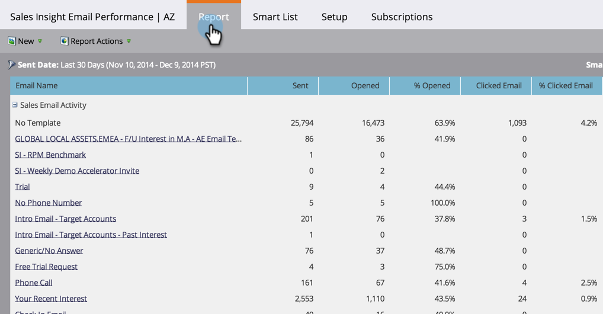
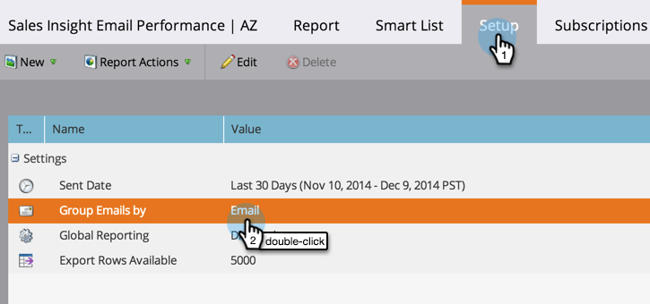

# Sales Insight 이메일 성과 보고서 {#sales-insight-email-performance-report}

Salesforce, Microsoft Dynamics, Gmail 또는 Outlook 플러그인을 통해 전송된 이메일의 성능을 확인할 수 있습니다.

## 보고서 생성 {#generate-a-report}

1. **분석**&#x200B;을 클릭합니다.

   

1. **Sales Insight 이메일 성과**&#x200B;를 클릭합니다.

   

1. **설정** 탭을 클릭하고 원하는 값을 선택합니다.

   

1. **보고서** 탭을 클릭합니다.

   

   좋아요! 이제 세일즈 팀에서 보낸 이메일이 어떻게 수행되었는지 확인할 수 있습니다.

   >[!NOTE]
   >
   >배달된 상태는 Sales Insight를 통해 전송된 이메일에 대해 캡처되지 않으며 이 보고서 또는 활동 로그에 포함되지 않습니다.

>[!TIP]
>
>이메일 미리 보기에서 이메일 이름을 클릭하여 엽니다.

## 영업 대표별 그룹 {#group-by-sales-rep}

설정을 변경하여 판매 대표별로 그룹화된 이 보고서를 볼 수 있습니다.

1. **설정**&#x200B;을 클릭합니다. **이메일**&#x200B;을 두 번 클릭합니다.

   

1. **영업 담당자**&#x200B;의 그룹 이메일을 선택합니다.

   

1. **저장**&#x200B;을 클릭합니다.

   

1. **보고서** 탭을 클릭합니다.

   

   꽤 멋지지? 이제 영업 대표별로 그룹화된 이메일의 성과를 확인할 수 있습니다.

