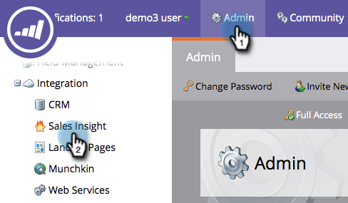

# 별 및 불꽃 사용자 지정 {#customize-stars-and-flames}

Marketing To Sales Insight는 스타와 불길을 사용하여 리드의 우선 순위를 지정합니다. 마케팅은 스타/화염1-2-3 누구인지 자동으로 결정한다. 하지만 공식을 수정할 수 있습니다. 방법은 다음과 같습니다.

>[!AVAILABILITY]
>
>
>모든 고객이 이 기능을 구입하지는 않았습니다. 자세한 내용은 영업 담당자에게 문의하십시오.

>[!NOTE]
>
>**관리자 권한 필요**

1. 관리에서 Sales Insight 를 클릭합니다.

1. **리드 채점 설정** 섹션에서 **편집**&#x200B;을 클릭합니다.

   

1. 원하는 **채점 방법**&#x200B;을 선택합니다.

   >[!NOTE]
   >
   >**정의**
   >
   >
   >**동적**  - 상대 데이터에서 파생된  [백분율 값입니다](priority-urgency-relative-score-and-best-bets.md). 멋진 물건이요 이 방법을 사용하는 것이 좋습니다.
   >
   >
   >**정적**  - 더 이상 백분율이 없고 비밀 소스 없이 정확한 점수 번호를 정의할 수 있습니다.

   

1. 원하는 대로 백분율 대괄호를 편집하고 **저장**&#x200B;을 클릭합니다.

   >[!TIP]
   >
   >
   >시작 백분율을 편집하면 Marketing To가 사용자를 위해 종료 백분율을 계산합니다.

   

>[!NOTE]
>
>**미리 알림**
>
>변경 사항이 적용되면 별과 불을 다시 계산하는데 시간이 걸립니다. 인내는 미덕이다.

여보! Marketing Cloud에서 비즈니스 요구 사항에 맞게 별과 화염을 계산하는 방법을 맞춤화했습니다.