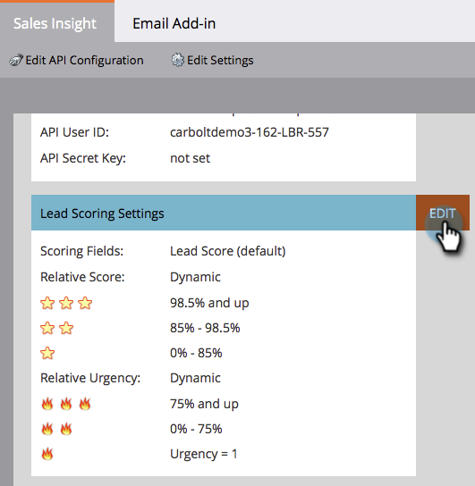

# 별 및 불꽃 사용자 정의 {#customize-stars-and-flames}

Marketing Sales Insight는 스타 및 화염을 사용하여 리드의 우선 순위를 지정합니다. 마케팅 팀은 1-2-3 별/화염에 대해 자동으로 결정한다. 하지만 공식을 수정할 수 있습니다. 방법은 다음과 같습니다.

>[!NOTE]
>
>**가용성**
>
>모든 고객이 이 기능을 구입하지는 않았습니다. 자세한 내용은 영업 담당자에게 문의하십시오.

>[!NOTE]
>
>**관리자 권한 필요**

1. 관리에서 영업 인사이트를 클릭합니다.

1. 리드 **점수 설정** 섹션에서 **편집을 클릭합니다**.

   

1. 선택한 **점수** 지정 방법을 선택합니다.

   >[!NOTE]
   >
   >**정의**
   >
   >
   >**동적** - [상대 데이터에서 파생된 백분율 값입니다](priority-urgency-relative-score-and-best-bets.md). 멋진 물건이야 이 방법을 사용하는 것이 좋습니다.
   >
   >
   >**정적** - 정확한 점수 수를 정의할 수 있습니다(백분율 없음, 비밀 소스 없음).

   

1. 백분율 대괄호를 좋아요 및 **저장에 맞게 편집합니다**.

   >[!TIP]
   >
   >
   >시작 비율을 편집하면 Marketing에서 사용자를 위해 종료 비율을 계산합니다.

   

>[!NOTE]
>
>**미리 알림**
>
>한번 변경되면 별과 불을 다시 계산하는 과정에는 시간이 걸릴 수 있습니다. 인내가 미덕이다.

여보! Marketing to가 비즈니스 요구 사항에 맞게 별과 화염을 계산하는 방식을 맞춤화한 것입니다.