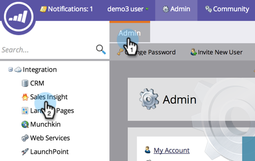

# 판매 인사이트의 별 및 화염에 사용할 점수 필드 설정 {#set-score-fields-to-be-used-for-stars-and-flames-in-sales-insight}

>[!NOTE]
>
>**관리자 권한 필요**

기본적으로 Marketing To Sales Insight는 **리드 점수** 필드를 사용하여 별과 불길을 계산합니다. 그러나 다른 필드를 선택하려면 다음 방법을 사용합니다.

>[!TIP]
>
>사용자 지정 점수 필드가 아직 없는 경우 [만들기](../../../../../product-docs/administration/field-management/create-a-custom-field-in-marketo.md)방법을 참조하십시오.

>[!NOTE]
>
>**정의**
>
>* **Star:**Star는 다른 리드와 비교하여 총 리드 점수를 나타냅니다.
>* **불꽃**:불길은 급박함을 나타냅니다 - 최근 얼마나 많은 납의 점수가 바뀌었는지를 나타냅니다.

>

1. **관리**&#x200B;에서 **영업 인사이트**&#x200B;를 클릭합니다.

   

1. **리드 채점 설정**&#x200B;에서 **편집**&#x200B;을 클릭합니다.

   

1. **별**&#x200B;에 사용할 필드를 선택합니다.

   

1. **불꽃**&#x200B;에 사용할 필드를 선택합니다.

   

   저장을 클릭합니다.
   

   >[!NOTE]
   >
   >다시 계산하려면 세일즈 인사이트가 필요합니다. 나중에 CRM에서 별과 화염을 확인할 수 있습니다.

   >[!NOTE]
   >
   >**관련 문서**
   >
   >
   >[우선 순위, 긴급성, 상대적인 점수 및 최고 점수](priority-urgency-relative-score-and-best-bets.md)

