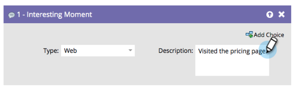

# 관심 항목 개요 {#interesting-moments-overview}

흥미로운 순차적 흐름 단계를 사용하여 영업 팀이 스마트 캠페인에서 수행하는 멋진 작업을 시각적으로 파악할 수 있습니다.

1. 사용할 흥미로운 모멘트 유형을 선택합니다.

   

1. 영업 팀이 볼 텍스트를 정의합니다.

   

>[!TIP]
>
>**더** 적은 양입니다. 세일즈 팀과 협력하여 흥미로운 순간이 실제로 흥미로운지 확인합니다.

흥미로운 순간에 토큰을 사용하여 유용한 동적 설명을 만들 수도 있습니다.

>[!MORELIKETHIS]
>
>* [관심 항목 사용](using-interesting-moments.md)
>* [관심 분야의 토큰](tokens-for-interesting-moments.md)

>

