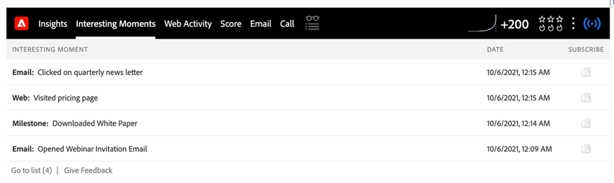

# 즐거운 순간 사용 {#using-interesting-moments}

흥미로운 순간은 [!DNL Marketo Sales Insight] 앱을 통해 영업 팀과 통신하는 데 중요한 부분입니다.

>[!AVAILABILITY]
>
>[!DNL Marketo Sales Insight] 및 [[!DNL Marketo Sales Connect]](/help/marketo/product-docs/marketo-sales-connect/marketo/interesting-moments-in-sales-connect.md) 고객만 사용할 수 있습니다.

## 흥미로운 순간이 뭐예요? {#what-is-an-interesting-moment}

그건 너한테 달렸어! 영업 팀과 관련된 정보를 결정합니다. 영업 팀은 잠재 고객 확보 시기를 알고 싶을 수 있습니다.

* 웹 사이트의 가격 페이지를 방문합니다.
* 새 제품 공지 이메일의 링크를 클릭합니다.
* 제품 데모 요청

## 어떻게 하면 재미있는 순간을 만들 수 있습니까?  {#how-do-i-create-an-interesting-moment}

1. [스마트 캠페인](/help/marketo/product-docs/core-marketo-concepts/smart-campaigns/understanding-smart-campaigns.md)을 선택하세요. 가능하면 영업 팀에서 관심을 보이는 캠페인을 선택하십시오.

   

1. **[!UICONTROL Interesting Moments]** 흐름 단계 위로 끌어서 놓습니다.

   

1. **type**([!UICONTROL Email], [!UICONTROL Milestone] 또는 [!UICONTROL Web])을(를) 선택하십시오.

   

1. 이 작업이 중요한 이유를 설명하는 메시지를 **[!UICONTROL Description]** 필드에 영업팀에 작성하십시오.

   

   >[!NOTE]
   >
   >Marketo은 발생한 날짜와 흥미로운 순간을 추가한 방법(예: 리드 작업 > 흐름 단계, SOAP API)도 추가합니다.

## 이게 어떻게 더 흥미로워지죠?  {#how-can-this-get-even-more-interesting}

토큰! 설명 필드에 이를 추가하여 잠재 고객이 개설한 이메일의 제목란이나 보낸 사람과 같은 보다 구체적인 정보를 영업팀에 제공합니다. [관심 있는 순간을 위한 토큰](/help/marketo/product-docs/marketo-sales-insight/msi-for-salesforce/features/tabs-in-the-msi-panel/interesting-moments/trigger-tokens-for-interesting-moments.md) 용어집에서 사용할 수 있는 토큰을 확인하십시오.

>[!TIP]
>
>5가지 흥미로운 순간으로 시작한 다음 영업 팀과 협력하여 보고 싶은 정보를 파악하십시오.

## Marketo에서 흥미로운 순간은 어떤 모습일까요?  {#what-does-an-interesting-moment-look-like-in-marketo}

즐거운 시간이 [리드의 활동 로그](/help/marketo/product-docs/core-marketo-concepts/smart-lists-and-static-lists/managing-people-in-smart-lists/using-the-person-detail-page.md)에 표시됩니다.

## [!DNL Salesforce]에서 즐거운 순간은 어떤 모습입니까?  {#what-does-an-interesting-moment-look-like-in-salesforce}

[앱 [!DNL Marketo Sales Insight] 을 설치](/help/marketo/product-docs/marketo-sales-insight/msi-for-salesforce/configuration/configure-marketo-sales-insight-in-salesforce-enterprise-unlimited.md)하면 리드, 연락처, 계정 또는 영업 기회 페이지에 즐거운 시간이 표시됩니다. [!DNL Sales Insight] 대시보드의 잠재 고객 피드, [!DNL Best Bets] 및 감시 목록에도 표시됩니다.

## [!DNL Salesforce1]에서 즐거운 순간은 어떤 모습입니까? {#what-does-an-interesting-moment-look-like-in-salesforce-1}

[!DNL Marketo Sales Insight]에 대해 [!DNL Salesforce1]을(를) 설치 또는 업데이트하면 리드의 관련 링크 아래에 흥미로운 상황이 표시됩니다.

## 즐거운 순간 구독 {#subscribe-to-interesting-moments}

관심 순간 탭 또는 리드 피드에서 [!UICONTROL Subscribe] 버튼을 클릭하여 관심 순간을 구독할 수 있습니다. 아래 단계는 두 단계에 대해 동일합니다.

1. 가입 아이콘을 클릭합니다. 그런 다음 이메일 구독 탭으로 이동합니다.

1. [!UICONTROL Name], [!UICONTROL Account], [!UICONTROL Type] 또는 [!UICONTROL Description]을(를) 기반으로 수신할 전자 메일 경고 유형을 선택할 수 있습니다.

1. 알림을 보낼 이메일 주소를 선택합니다(본인/팀원).

1. **[!UICONTROL Subscribe]**&#x200B;을(를) 클릭합니다.

>[!NOTE]
>
>관심 모멘트 유형 또는 설명을 구독하면 사용자는 해당 유형 또는 설명과 일치하는 관심 모멘트 를 트리거할 때 소유한 사람(리드/연락처)에 대한 이메일 알림을 받게 됩니다.

