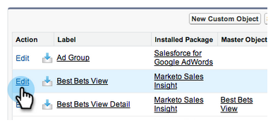

# [!DNL Marketo Sales Insight] AppExchange에 [!DNL Salesforce] 패키지 설치 {#install-marketo-sales-insight-package-in-salesforce-appexchange}

[!DNL Marketo Sales Insight]에서 제공하는 혜택을 모두 이용하려면 먼저 [!DNL Salesforce] 구독에 [!DNL Sales Insight] 앱을 설치해야 합니다. 방법은 다음과 같습니다.

>[!NOTE]
>
>**관리자 권한 필요**

>[!NOTE]
>
>[!DNL Marketo Sales Insight]은(는) [!DNL Salesforce] 플랫폼(Shield) 암호화와 호환됩니다.

1. [&#x200B; [!DNL Marketo Sales Insight]의 &#x200B;](https://appexchange.salesforce.com/listingDetail?listingId=a0N30000001SVZmEAO)AppExchange 페이지로 이동한 다음 **[!UICONTROL Get it Now]**&#x200B;을(를) 클릭합니다.

   

1. **[!UICONTROL Log in to the AppExchange]** 단추를 클릭하고 [!DNL Salesforce] 자격 증명으로 로그인합니다.

1. 연결된 [!DNL Salesforce] 계정 로그인을 입력하고 **[!UICONTROL Install in Production]**&#x200B;을(를) 클릭합니다.

   

   >[!TIP]
   >
   >먼저 샌드박스에서 테스트하려면 **[!UICONTROL Install in Sandbox]**&#x200B;을(를) 선택하세요.

1. 약관을 읽고 동의한 다음 **[!UICONTROL Confirm and Install]**&#x200B;을(를) 클릭합니다.

   

1. &quot;[!UICONTROL Install for Admins Only]&quot;(및 나중에 특정 프로필에 대한 MSI 액세스 제공), &quot;[!UICONTROL Install for All Users]&quot; 또는 &quot;[!UICONTROL Install for Specific Profiles]&quot;을(를) 선택할 수 있습니다.

   

1. 설치 프로세스를 시작하면 다음 메시지가 표시될 수 있습니다. 설치가 완료되면 이메일이 전송됩니다. 닫으려면 **완료**&#x200B;를 클릭하십시오.

   

1. **[!UICONTROL Marketo Sales Insight]**&#x200B;이(가) 설치된 패키지에 있는지 확인하십시오.

   

1. 이름 옆에 있는 **[!UICONTROL Setup]**&#x200B;을(를) 클릭합니다.

   

1. &quot;[!UICONTROL objects]&quot;을(를) 검색한 다음 **[!UICONTROL Objects]** 아래의 **[!UICONTROL Create]**&#x200B;을(를) 클릭합니다.

   

1. **[!UICONTROL Deployed]**&#x200B;이(가) 모든 [!DNL Marketo Sales Insight]개 항목에 대해 확인되었는지 다시 확인하십시오.

   

1. 개체가 배포되지 않은 경우 항목 옆에 있는 **[!UICONTROL Edit]**&#x200B;을(를) 클릭합니다.

   

1. **[!UICONTROL Deployment Status]** 섹션에서 **[!UICONTROL Deployed]**&#x200B;을(를) 선택하고 **[!UICONTROL Save]**&#x200B;을(를) 클릭합니다.

   

좋습니다! 이제 [!DNL Marketo Sales Insight]을(를) 설치 및 배포했습니다. 판매팀을 위해 구성하고 판매량이 급증하는 것을 확인하십시오.

>[!MORELIKETHIS]
>
>* [구성 [!DNL Marketo Sales Insight] in [!DNL Salesforce] 전문 에디션](/help/marketo/product-docs/marketo-sales-insight/msi-for-salesforce/configuration/configure-marketo-sales-insight-in-salesforce-professional-edition.md)
>* [구성 [!DNL Marketo Sales Insight] in [!DNL Salesforce] Enterprise/Unlimited](/help/marketo/product-docs/marketo-sales-insight/msi-for-salesforce/configuration/configure-marketo-sales-insight-in-salesforce-enterprise-unlimited.md)
>* [프로필에 판매 Insight 액세스 추가](/help/marketo/product-docs/marketo-sales-insight/msi-for-salesforce/configuration/add-sales-insight-access-to-profiles.md){target="_blank"}
