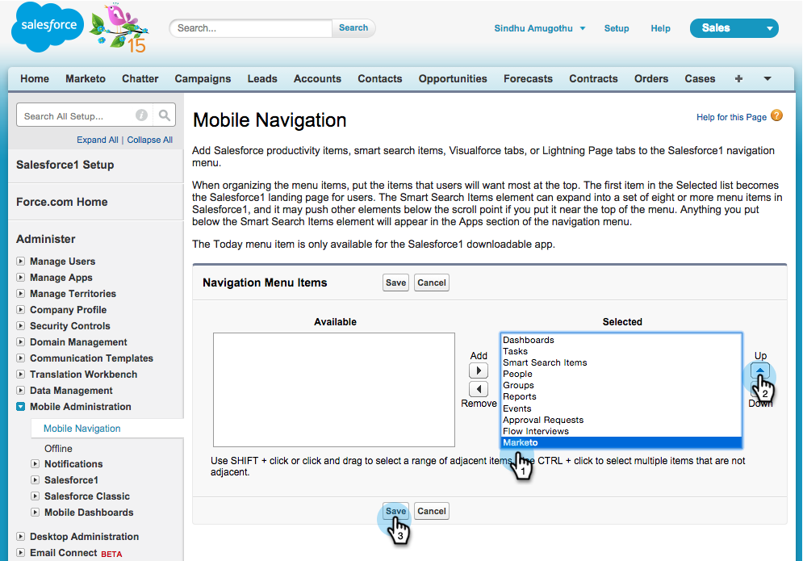
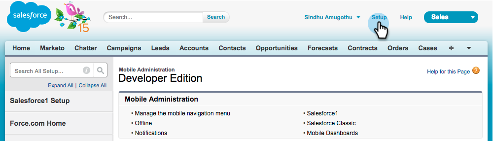
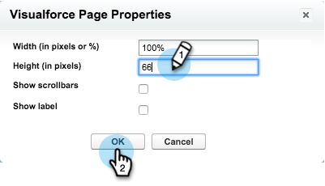
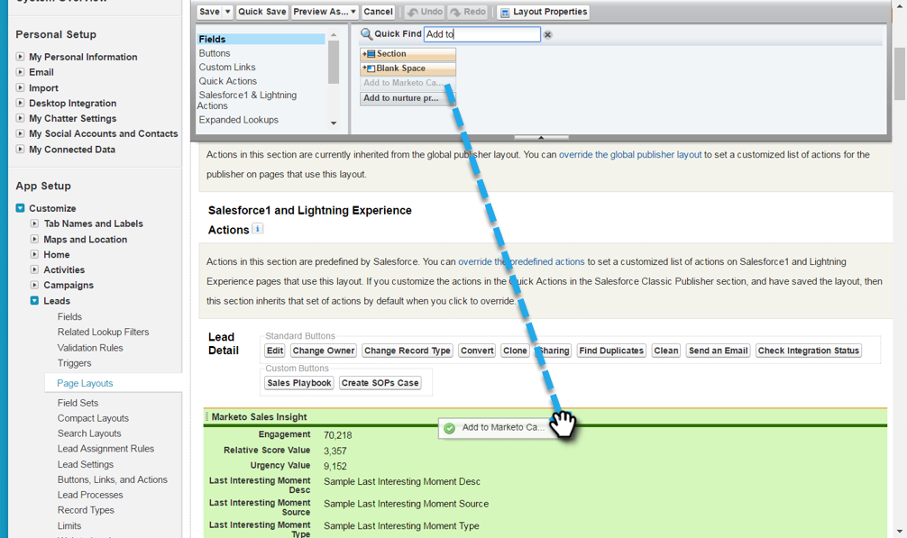

# Salesforce1에서 Marketing To Sales Insight 설치 및 구성 {#install-and-configure-marketo-sales-insight-in-salesforce}

>[!NOTE]
>
>**미리 알림**
>
>기존 고객입니다. [계속하기 전에 MSI 패키지를](http://docs.marketo.com/x/_gU6Ag) 업그레이드하십시오!

>[!PREREQUISITES]
>
>Salesforce Enterprise/Unlimited가 있는 경우:
>
>* [3단계 중 1단계:Salesforce에 마케팅 필드 추가(Enterprise/Unlimited)](../../../../product-docs/crm-sync/salesforce-sync/setup/enterprise-unlimited-edition/step-1-of-3-add-marketo-fields-to-salesforce-enterprise-unlimited.md)
>* [3단계 중 2단계:Marketing To용 Salesforce 사용자 만들기(Enterprise/Unlimited)](../../../../product-docs/crm-sync/salesforce-sync/setup/enterprise-unlimited-edition/step-2-of-3-create-a-salesforce-user-for-marketo-enterprise-unlimited.md)
>* [3단계 중 3단계:Connect Marketing 및 Salesforce(Enterprise/Unlimited)](../../../../product-docs/crm-sync/salesforce-sync/setup/enterprise-unlimited-edition/step-3-of-3-connect-marketo-and-salesforce-enterprise-unlimited.md)
>* [Salesforce Enterprise에서 Marketing to Sales Insight 구성/제한 없음](../../../../product-docs/marketo-sales-insight/msi-for-salesforce/configuration/configure-marketo-sales-insight-in-salesforce-enterprise-unlimited.md)

>
>
Salesforce Professional이 있는 경우
>
>* [Salesforce Professional Edition에서 Marketing to Sales Insight 구성](../../../../product-docs/marketo-sales-insight/msi-for-salesforce/configuration/configure-marketo-sales-insight-in-salesforce-professional-edition.md)

>

>[!NOTE]
>
>Salesforce1의 Marketing To Sales Insight에는 다음이 포함됩니다.최고의 베스트팅, 리드 피드, 흥미로운 순간들 및 Marketing To 캠페인에 추가

1. Salesforce1 모바일 앱 활성화
1. 설정 **을** 클릭한 다음 **모바일 관리를 클릭합니다**.

   

1. Salesforce1 **을 클릭합니다**.

   

1. Salesforce1 **설정을 클릭합니다**.

   

1. Salesforce1 **모바일 브라우저 앱 활성화를 클릭합니다**.

   

1. 저장을 **클릭합니다**.

   

1. [ **모바일 관리]를 선택합니다**.

   

1. 모바일 탐색 메뉴 **관리를 클릭합니다**.

   

1. **Marketing **및 **Add **it를 **Selected **메뉴 항목에 선택합니다.

   

1. 마케팅을 **선택하고****위로 이동한 다음 저장을 **클릭합니다**.

   

1. 오래된 마케팅 사용자 지정 개체 숨기기
1. 설정을 **클릭합니다**.

   

1. 사용자 **관리를 선택합니다**.

   

1. 프로필을 **선택합니다**.

   

1. **edit **원하는 프로파일을 클릭합니다.

   

1. 탭 **설정**&#x200B;아래에서 *첫* 번째 **마케팅을**&#x200B;선택합니다.

   ** 

   **

1. 탭 **숨김을 선택합니다**.

   ** 

   **

   >[!NOTE]
   >
   >원하는 모든 프로필에 대한 마케팅 탭을 숨기십시오.

1. 탭 사용자 지정
1. 클릭** +*.

   

1. 내 탭 **사용자 지정을 클릭합니다**.

   

1. Marketing **To** 및 **Add **it를 선택한 탭에 선택합니다.

   

1. 마케팅을 **선택하고****위로 이동한 다음 저장을 **클릭합니다**.

   

1. 페이지 레이아웃 사용자 지정
1. 설정을 **클릭합니다**.

   

1. 설정 **을**&#x200B;클릭하고 **페이지 레이아웃을**&#x200B;입력한 다음 리드 아래에 있는 **페이지 레이아웃** 을클릭합니다.

   >[!NOTE]
   >
   >조직에서 사용하는 모든 페이지 레이아웃(마케팅, 영업 등)에 대해 이 단계를 반복합니다. 을 참조하십시오.

   

1. 편집 **을** 클릭하여 리드 레이아웃을 변경합니다.

   

1. **Visualforce 페이지 **를 클릭한 다음 리드 모바일 **을 모바일 카드 섹션으로 드래그합니다** .

   

1. 높이를 66으로 변경하고 확인 **을 클릭합니다**.

   

1. 필드 **를** 클릭하고 **Marketing to Campaign에 **** 추가를 Marketing to Sales Insight **섹션으로 드래그합니다.

   

   >[!TIP]
   >
   >빠른 검색에 &quot;추가 대상&quot;을 입력하여 Marketing To 캠페인에 쉽게 추가합니다.

1. 저장을 **클릭합니다**.

   

휴! Salesforce1용 Marketing To Sales Insight의 설치가 완료되었습니다. 먼저 가셔서 뒤쪽으로도 쓰다듬어 주세요.

>[!NOTE]
>
>**관련 문서**
>
>* [Salesforce의 최고의 솔루션1](best-bets-in-salesforce1.md)
>* [Salesforce의 흥미로운 순간1](interesting-moments-in-salesforce1.md)
>* [Salesforce1에서 Marketing To 이메일 및 캠페인 및 Watchlist 동작 보내기](send-marketo-email-and-campaign-and-watchlist-actions-in-salesforce1.md)

>

