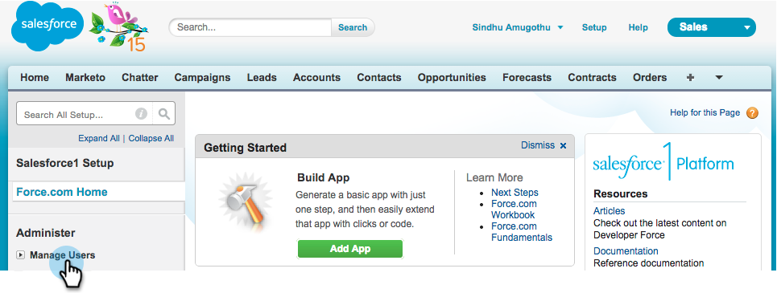
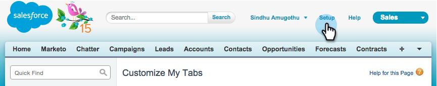

# Salesforce1에서 Marketo Sales Insight 설치 및 구성 {#install-and-configure-marketo-sales-insight-in-salesforce}

>[!NOTE]
>
>기존 고객은 계속하기 전에 [MSI 패키지를 업그레이드](/help/marketo/product-docs/marketo-sales-insight/msi-for-salesforce/upgrading/upgrading-your-msi-package.md)하십시오!

>[!PREREQUISITES]
>
>Salesforce Enterprise/Unlimited가 있는 경우:
>
>* [3단계 중 1단계: Salesforce(Enterprise/Unlimited)에 Marketo 필드 추가](/help/marketo/product-docs/crm-sync/salesforce-sync/setup/enterprise-unlimited-edition/step-1-of-3-add-marketo-fields-to-salesforce-enterprise-unlimited.md)
>* [3단계 중 2단계: Marketo(Enterprise/Unlimited)용 Salesforce 사용자 만들기](/help/marketo/product-docs/crm-sync/salesforce-sync/setup/enterprise-unlimited-edition/step-2-of-3-create-a-salesforce-user-for-marketo-enterprise-unlimited.md)
>* [3단계 중 3단계: Marketo 및 Salesforce(Enterprise/Unlimited) 연결](/help/marketo/product-docs/crm-sync/salesforce-sync/setup/enterprise-unlimited-edition/step-3-of-3-connect-marketo-and-salesforce-enterprise-unlimited.md)
>* [Salesforce Enterprise/Unlimited에서 Marketo Sales Insight 구성](/help/marketo/product-docs/marketo-sales-insight/msi-for-salesforce/configuration/configure-marketo-sales-insight-in-salesforce-enterprise-unlimited.md)
>
>Salesforce Professional이 있는 경우:
>
>* [Salesforce Professional Edition에서 Marketo Sales Insight 구성](/help/marketo/product-docs/marketo-sales-insight/msi-for-salesforce/configuration/configure-marketo-sales-insight-in-salesforce-professional-edition.md)
>

>[!NOTE]
>
>Salesforce1의 Marketo Sales Insight에는 최상의 선택, 리드 피드, 흥미로운 순간 및 Marketo 캠페인에 추가 기능이 포함됩니다.

## Salesforce1 모바일 앱 활성화 {#enable-the-salesforce1-mobile-app}

1. **설치**&#x200B;를 클릭한 다음 **모바일 관리**&#x200B;를 클릭합니다.

   

1. **Salesforce1**&#x200B;을(를) 클릭합니다.

   

1. **Salesforce1 설정**&#x200B;을 클릭합니다.

   

1. **Salesforce1 모바일 브라우저 앱 사용**&#x200B;을 클릭합니다.

   

1. **저장**&#x200B;을 클릭합니다.

   

1. **모바일 관리**&#x200B;를 선택합니다.

   

1. **모바일 탐색 메뉴 관리**&#x200B;를 클릭합니다.

   

1. **Marketo**&#x200B;을(를) 선택하고 **선택됨** 메뉴 항목에 **추가**&#x200B;합니다.

   

1. **Marketo**&#x200B;을(를) 선택하고 **위로**&#x200B;를 원하는 영역으로 이동한 다음 **저장**&#x200B;을(를) 클릭합니다.

   

## 오래된 Marketo 사용자 지정 개체 숨기기 {#hide-outdated-marketo-custom-object}

1. **설치**&#x200B;를 클릭합니다.

   

1. **사용자 관리**&#x200B;를 선택합니다.

   

1. **프로필**&#x200B;을 선택하세요.

   

1. 원하는 프로필을 **편집**&#x200B;하려면 클릭하세요.

   

1. **탭 설정**&#x200B;에서 _처음_ **Marketo**&#x200B;을(를) 선택합니다.

   

1. **숨겨진 탭**&#x200B;을 선택합니다.

   

   >[!NOTE]
   >
   >원하는 모든 프로필에 대해 Marketo 탭을 숨기십시오!

## 탭 맞춤화 {#customize-tabs}

1. **+**&#x200B;을(를) 클릭합니다.

   

1. **내 탭 맞춤화**&#x200B;를 클릭합니다.

   

1. **Marketo**&#x200B;을(를) 선택하고 선택한 탭에 **추가**&#x200B;합니다.

   

1. **Marketo**&#x200B;을(를) 선택하고 **위로**&#x200B;를 원하는 영역으로 이동한 다음 **저장**&#x200B;을(를) 클릭합니다.

   

## 페이지 레이아웃 사용자 지정 {#customize-page-layouts}

1. **설치**&#x200B;를 클릭합니다.

   

1. **설정**&#x200B;을 클릭하고 **페이지 레이아웃**&#x200B;을 입력한 다음 리드 아래의 **페이지 레이아웃**&#x200B;을 클릭합니다.

   >[!NOTE]
   >
   >조직에서 사용하는 모든 페이지 레이아웃(마케팅, 판매 등)에 대해 이 단계를 반복합니다 연락처, 계정 및 영업 기회 객체.

   

1. 리드 레이아웃을 변경하려면 **편집**&#x200B;을(를) 클릭하십시오.

   

1. **Visualforce 페이지**&#x200B;를 클릭한 다음 **모바일 리드**&#x200B;를 모바일 카드 섹션으로 끌어옵니다.

   

1. 높이를 66으로 변경하고 **확인**&#x200B;을 클릭합니다.

   

1. **필드**&#x200B;를 클릭하고 **Marketo 캠페인에 추가**&#x200B;를 **Marketo Sales Insight** 섹션으로 끌어옵니다.

   

   >[!TIP]
   >
   >Marketo Campaign에 추가를 쉽게 찾을 수 있도록 빠른 찾기에 &quot;추가&quot;를 입력합니다.

1. **저장**&#x200B;을 클릭합니다.

   

휴! 드디어 Marketo Sales Insight for Salesforce1 설치를 완료했습니다! 어서 허리를 쓰다듬어 봐.

>[!MORELIKETHIS]
>
>* [Salesforce에서 최상의 선택1](/help/marketo/product-docs/marketo-sales-insight/msi-for-salesforce/msi-for-mobile/best-bets-in-salesforce1.md)
>* [Salesforce의 흥미로운 순간1](/help/marketo/product-docs/marketo-sales-insight/msi-for-salesforce/msi-for-mobile/interesting-moments-in-salesforce1.md)
>* [Salesforce1에서 Marketo 전자 메일 및 Campaign 및 Watchlist 작업 보내기](/help/marketo/product-docs/marketo-sales-insight/msi-for-salesforce/msi-for-mobile/send-marketo-email-and-campaign-and-watchlist-actions-in-salesforce1.md)
