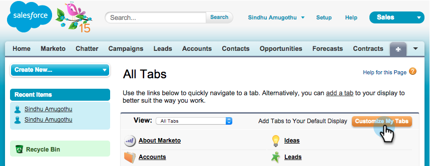

# Salesforce1에서 Marketo Sales Insight 설치 및 구성 {#install-and-configure-marketo-sales-insight-in-salesforce}

>[!NOTE]
>
>기존 고객님 부탁합니다 [MSI 패키지 업그레이드](/help/marketo/product-docs/marketo-sales-insight/msi-for-salesforce/upgrading/upgrading-your-msi-package.md) 계속하기 전에

>[!PREREQUISITES]
>
>Salesforce Enterprise/Unlimited가 있는 경우:
>
>* [3단계 중 1단계: Salesforce에 Marketo 필드 추가(Enterprise/Unlimited)](/help/marketo/product-docs/crm-sync/salesforce-sync/setup/enterprise-unlimited-edition/step-1-of-3-add-marketo-fields-to-salesforce-enterprise-unlimited.md)
>* [3단계 중 2단계: Marketo용 Salesforce 사용자 만들기(Enterprise/Unlimited)](/help/marketo/product-docs/crm-sync/salesforce-sync/setup/enterprise-unlimited-edition/step-2-of-3-create-a-salesforce-user-for-marketo-enterprise-unlimited.md)
>* [3단계 중 3단계: Marketo 및 Salesforce 연결(Enterprise/Unlimited)](/help/marketo/product-docs/crm-sync/salesforce-sync/setup/enterprise-unlimited-edition/step-3-of-3-connect-marketo-and-salesforce-enterprise-unlimited.md)
>* [Salesforce Enterprise/Unlimited에서 Marketo Sales Insight 구성](/help/marketo/product-docs/marketo-sales-insight/msi-for-salesforce/configuration/configure-marketo-sales-insight-in-salesforce-enterprise-unlimited.md)
>
>Salesforce Professional이 있는 경우:
>
>* [Salesforce Professional Edition에서 Marketo Sales Insight 구성](/help/marketo/product-docs/marketo-sales-insight/msi-for-salesforce/configuration/configure-marketo-sales-insight-in-salesforce-professional-edition.md)
>

>[!NOTE]
>
>Salesforce1의 Marketo Sales Insight 에는 다음이 포함됩니다. Marketo Campaign에 최상의 선택, 리드 피드, 흥미로운 순간 및 추가

## Salesforce1 모바일 앱 활성화 {#enable-the-salesforce1-mobile-app}

1. 클릭 **설정** 그리고 **모바일 관리**.

   

1. 클릭 **Salesforce1**.

   

1. 클릭 **Salesforce1 설정**.

   

1. 클릭 **Salesforce1 모바일 브라우저 앱 활성화**.

   

1. 클릭 **저장**.

   

1. 선택 **모바일 관리**.

   

1. 클릭 **모바일 탐색 메뉴 관리**.

   

1. 선택 **Marketo** 및 **추가** 다음으로 **선택됨** 메뉴 항목.

   

1. 선택 **Marketo**, 이동 **위로** 원하는 영역으로 이동하여 **저장**.

   

## 오래된 Marketo 사용자 지정 개체 숨기기 {#hide-outdated-marketo-custom-object}

1. 클릭 **설정**.

   

1. 선택 **사용자 관리**.

   

1. 선택 **프로필**.

   

1. 클릭하여 **편집** 원하는 프로필.

   

1. 아래 **탭 설정**&#x200B;에서 을(를) 선택합니다. _첫 번째_ **Marketo**.

   

1. 선택 **숨겨진 탭**.

   

   >[!NOTE]
   >
   >원하는 모든 프로필에 대한 Marketo 탭을 숨기십시오!

## 탭 사용자 지정 {#customize-tabs}

1. 클릭 **+**.

   

1. 클릭 **내 탭 사용자 지정**.

   

1. 선택 **Marketo** 및 **추가** 선택한 탭으로 이동합니다.

   

1. 선택 **Marketo**, 이동 **위로** 원하는 영역으로 이동하여 **저장**.

   

## 페이지 레이아웃 사용자 지정 {#customize-page-layouts}

1. 클릭 **설정**.

   

1. 클릭 **설정**, 유형 **페이지 레이아웃**&#x200B;를 클릭하고 **페이지 레이아웃** 리드 아래에 표시됩니다.

   >[!NOTE]
   >
   >조직에서 사용하는 모든 페이지 레이아웃(마케팅, 판매 등)에 대해 이 단계를 반복합니다. Contact, Account 및 Opportunity 객체에 대한 정보를 제공합니다.

   

1. 클릭 **편집** 리드 레이아웃을 변경하려면 다음을 수행하십시오.

   

1. 클릭 **Visualforce 페이지** 그리고 드래그하여 **리드 모바일** 모바일 카드 섹션으로 이동합니다.

   

1. 높이 를 66으로 변경하고 를 클릭합니다 **확인**.

   

1. 클릭 **필드** 드래그 **Marketo Campaign에 추가** 변환 후 **Marketo Sales Insight** 섹션을 참조하십시오.

   

   >[!TIP]
   >
   >Marketo Campaign에 추가를 쉽게 찾을 수 있도록 빠른 찾기에 &quot;추가 대상&quot;을 입력합니다.

1. 클릭 **저장**.

   

휴! Salesforce1용 Marketo Sales Insight1를 마침내 설치했습니다. 가서 뒷부분을 쓰다듬어 보세요.

>[!MORELIKETHIS]
>
>* [Salesforce에서 최고의 선택1](/help/marketo/product-docs/marketo-sales-insight/msi-for-salesforce/msi-for-mobile/best-bets-in-salesforce1.md)
>* [Salesforce의 흥미로운 순간1](/help/marketo/product-docs/marketo-sales-insight/msi-for-salesforce/msi-for-mobile/interesting-moments-in-salesforce1.md)
>* [Salesforce1에서 Marketo 이메일 및 캠페인 및 Watchlist 작업 보내기](/help/marketo/product-docs/marketo-sales-insight/msi-for-salesforce/msi-for-mobile/send-marketo-email-and-campaign-and-watchlist-actions-in-salesforce1.md)

