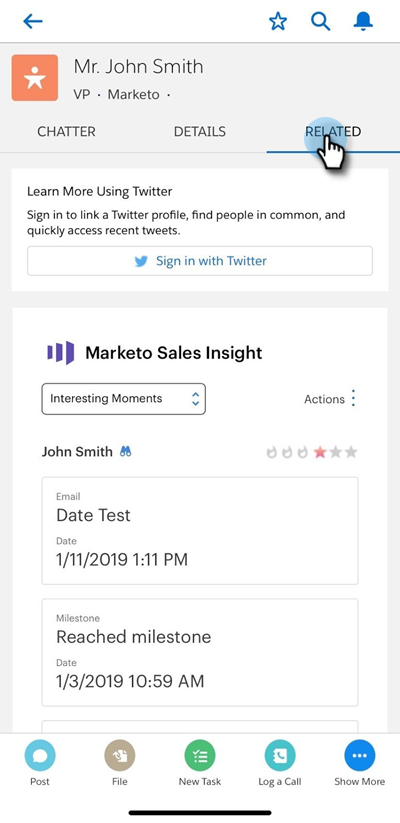

# Salesforce1에서 Marketo 이메일, 캠페인 및 관심 목록 작업 보내기 {#send-marketo-email-and-campaign-and-watchlist-actions-in-salesforce}

1. Salesforce1의 잠재 고객 세부 정보 영역으로 이동하여 **관련** 탭을 클릭합니다.

   

1. 도타(세 개의 작은 점)를 클릭합니다. 맨 아래에 있는 &quot;Marketo Campaign에 추가&quot;, &quot;Marketo 이메일 보내기&quot;, &quot;Marketo에서 보기&quot;, &quot;관심 목록에서 추가/제거&quot;에서 선택할 수 있습니다.

   

   >[!NOTE]
   >
   >어떤 스마트 캠페인이 표시됩니까? &quot;Campaign이 요청됨&quot; 트리거가 있는 트리거입니다. &quot;캠페인이 요청됨[&#128279;](/help/marketo/product-docs/core-marketo-concepts/smart-campaigns/flow-actions/request-campaign.md)&quot;을(를) 사용하여 트리거된 캠페인을 설정하는 방법을 알아봅니다.

좋습니다. 이제 영업사원이 마케팅 활동에 적극적으로 참여할 수 있습니다.

>[!NOTE]
>
>**예**
>
>요청하기 좋은 스마트 캠페인은 다음과 같이 들릴 수 있습니다.
>
>1. 장기 육성 - 올해 예산이 없을 때
>1. 활성 판매 주기 - 영업 사원이 잠재 고객에 대한 메시지를 자신의 메시지를 제외하고 원하지 않는 경우(일시적으로 가입을 해지하려면 마케팅 중단 플래그를 사용)
>
>창의적이 되세요. 영업 사원이 자동화할 내용 그들에게 물어보고 전선을 연결하기만 하면 됩니다!
