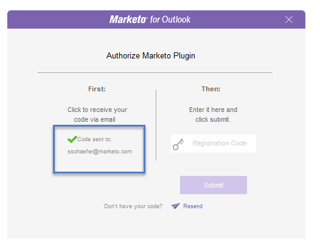

# Marketing To Outlook 플러그인 승인 {#authorize-the-marketo-outlook-plugin}

Outlook에서 Marketing MSI 플러그인을 사용하려면 인증해야 합니다.

>[!NOTE]
>
>**사전 요구 사항**
>
>플러그인은 이미 설치되어 있어야 하며 Marketing Admin에서 플러그인 사용자로 인증되어야 합니다.

1. 마케팅 메시지 단추 중 하나를 클릭합니다.

   

1. Marketing to 플러그인 승인 대화 상자가 나타나면 **요청 코드를 클릭합니다**.

   

1. 코드가 기본 Outlook 계정 이메일 주소로 전송됩니다.

   

1. 기본 Outlook 계정 이메일 주소가 체크 아웃되면 등록 키가 수신됩니다. 팝업에 입력하고 [제출]을 **클릭합니다**.

   

   >[!NOTE]
   >
   >등록 코드는 14일 후 **만료됩니다.**

1. 이메일 주소가 인증되지 않은 경우 덜 행복한 이메일을 받게 됩니다. 문제를 해결하려면 마케팅 관리자에게 문의하십시오.

   

