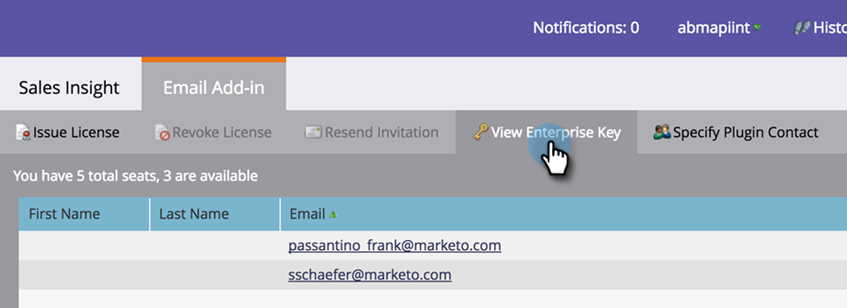

# Enterprise 키 {#install-the-marketo-add-in-for-outlook-with-an-enterprise-key}과(와) 함께 Outlook용 Marketing To Add-in 설치

세일즈 담당자는 자신의 랩탑에서 관리 권한이 없으며 IT 팀이 모든 소프트웨어를 원격으로 설치할 수 있습니다. Outlook용 Marketing To Add-in은 Enterprise 키를 사용하여 이 방법으로 설치할 수 있습니다. 이 키는 Admin의 Sales Insight 섹션에 있습니다.

>[!PREREQUISITES]
>
>관리자는 [마케팅 전자 메일 추가 기능 라이선스를 발급해야 합니다](issue-a-marketo-email-add-in-license.md).

>[!NOTE]
>
>[기업 키 보기] 단추가 표시되지 않으면 [`[email protected]`](http://docs.marketo.com/cdn-cgi/l/email-protection#1c6f696c6c736e685c717d6e77796873327f7371)에 문의하여 활성화합니다.

1. 내 마켓플레이스에서 **관리**&#x200B;를 클릭한 다음 **영업 인사이트**&#x200B;를 클릭합니다.

   

1. **Email Add-In** 탭을 클릭합니다.

   

1. **기업 키 보기**&#x200B;를 클릭합니다.

   

1. Outlook Enterprise 라이선스 키를 복사하여 [이 링크](marketo-outlook-plugin-installation-by-it.md)와 함께 전자 메일에 붙여 넣은 다음 원격 설치를 위해 IT 부서에 보냅니다.

   

   그게 다예요! 그런 다음 영업 담당자가 [등록 프로세스](authorize-the-marketo-outlook-plugin.md)를 진행합니다. 지침에 대한 링크를 보낼 수 있습니다(**Marketing to 관련 문서** 참조).

   >[!MORELIKETHIS]
   >
   >
   >    
   >    
   >    * [Marketing To Outlook 플러그인 승인](authorize-the-marketo-outlook-plugin.md)

