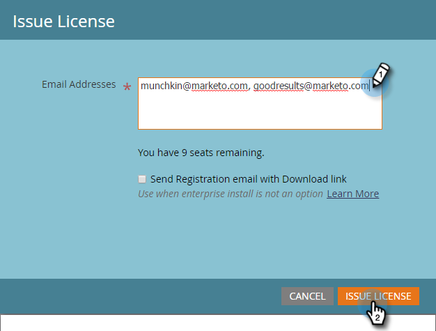

# Marketo 이메일 추가 기능 라이선스 발행 {#issue-a-marketo-email-add-in-license}

Marketo 전자 메일 [!DNL Outlook] 추가 기능을 사용하려면 먼저 라이선스가 발급되어야 합니다. 라이센스를 제공하는 방법에는 두 가지가 있습니다.

* **[엔터프라이즈 키 설치](/help/marketo/product-docs/marketo-sales-insight/msi-outlook-plugin/install-the-marketo-add-in-for-outlook-with-an-enterprise-key.md)**: 영업 담당자가 회사 랩톱에 대한 관리자 권한이 없고 플러그인, 소프트웨어 등을 설치할 수 없는 경우 이 방법을 사용합니다. 좋아. 이 경우 Marketo 관리자는 승인된 사용자 목록에 라이선스를 발급합니다. 다음으로 IT팀은 엔터프라이즈 키를 사용하여 권한이 부여된 모든 사용자의 컴퓨터에 플러그인을 원격으로 배포합니다. 그런 다음 플러그인 사용자가 권한을 부여합니다.
* **[등록 코드 설치](/help/marketo/product-docs/marketo-sales-insight/msi-outlook-plugin/install-the-marketo-email-add-in-for-outlook-with-a-registration-code.md)**: 영업 담당자가 회사 랩톱에 대한 관리자 권한이 있고 플러그인, 소프트웨어 등을 설치할 수 있는 경우 이 방법을 사용합니다. 좋아. 이 프로세스를 위해 Marketo 관리자는 승인된 사용자 목록에 라이선스를 발급하고 다운로드 링크로 직접 등록 이메일을 보냅니다. Sales Rep 는 플러그인 다운로드 링크와 고유한 등록 URL이 포함된 이메일을 수신합니다.

>[!AVAILABILITY]
>
>모든 Marketo Engage 사용자가 이 기능을 구입한 것은 아닙니다. 자세한 내용은 Adobe 계정 팀(계정 관리자)에 문의하십시오.

>[!NOTE]
>
>**관리자 권한 필요**

1. 내 Marketo에서 **[!UICONTROL Admin]**&#x200B;을(를) 클릭한 다음 **[!UICONTROL Sales Insight]**&#x200B;을(를) 클릭합니다.

1. **[!UICONTROL Email Add-in]** 탭에서 **[!UICONTROL Issue License]**&#x200B;을(를) 클릭합니다.

   

1. 플러그 인을 사용할 수 있는 권한이 필요한 영업 담당자의 전자 메일 주소를 입력하고 **[!UICONTROL Issue License]**&#x200B;을(를) 클릭합니다.

   >

   >[!TIP]
   >
   >여러 이메일 주소를 쉼표로 구분하여 입력할 수 있습니다.

   >[!NOTE]
   >
   >플러그인을 원격으로 설치하려면 확인란을 선택하지 않고 IT 팀에 [Enterprise 키](/help/marketo/product-docs/marketo-sales-insight/msi-outlook-plugin/install-the-marketo-add-in-for-outlook-with-an-enterprise-key.md)를 보내십시오.
   >
   >Sales Rep 가 자신의 컴퓨터에 대한 관리자 액세스 권한을 보유하고 있다면 확인란을 선택하면 모든 작업이 완료됩니다.

>[!MORELIKETHIS]
>
>* [Enterprise 키로  [!DNL Outlook] Marketo 추가 기능 설치](/help/marketo/product-docs/marketo-sales-insight/msi-outlook-plugin/install-the-marketo-add-in-for-outlook-with-an-enterprise-key.md)
>* [등록 코드로  [!DNL Outlook] Marketo 전자 메일 추가 기능 설치](/help/marketo/product-docs/marketo-sales-insight/msi-outlook-plugin/install-the-marketo-email-add-in-for-outlook-with-a-registration-code.md)
>* [용 Marketo Email 추가 기능 업그레이드 [!DNL Outlook]](/help/marketo/product-docs/marketo-sales-insight/msi-outlook-plugin/upgrade-your-marketo-email-add-in-for-outlook.md)
