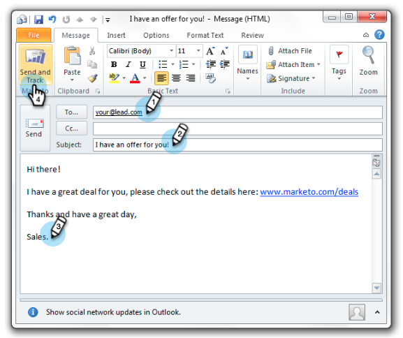

# Outlook용 전자 메일 추가 기능을 사용하여 전자 메일 보내기 및 추적 {#send-and-track-an-email-with-the-email-add-in-for-outlook}

Outlook에서 직접 Marketo으로 이메일을 전송하고 추적할 수 있습니다.

>[!PREREQUISITES]
>
>아직 설치하지 않은 경우 [Outlook용 Marketo 이메일 추가 기능](/help/marketo/product-docs/marketo-sales-insight/msi-outlook-plugin/install-the-marketo-email-add-in-for-outlook-with-a-registration-code.md).

1. Microsoft Outlook을 열고 새 이메일을 만듭니다.

   

   >[!CAUTION]
   >
   >이메일에 여러 수신자를 포함하는 경우 모든 활동이 첫 번째 수신자 아래에서 추적됩니다.

1. 평소대로 이메일을 작성한 다음 **보내기 및 추적**.

   

   >[!NOTE]
   >
   >Marketo 인스턴스에 없는 사람에게 이메일을 보낼 경우 개인 레코드가 자동으로 생성됩니다. 그들의 성은 쉽게 찾을 수 있도록 항상 &#39;mktUnknown&#39;입니다.

   >[!TIP]
   >
   >Marketo 템플릿을 사용하려면 다음을 참조하십시오. [템플릿을 사용하여 Outlook에서 보내기 및 추적](/help/marketo/product-docs/marketo-sales-insight/msi-outlook-plugin/send-and-track-from-outlook-using-a-marketo-template.md).

1. 미리 보기를 보고 를 클릭합니다 **보내기**.

   

   >[!CAUTION]
   >
   >스팸 방지 기술은 이메일을 보낸 후 20초 이내에 발생하는 열기 및 클릭 수를 종종 거부하므로 테스트하는 동안 열기/클릭이 적어도 오래 기다리십시오.

   Outlook을 통해 보낸 전자 메일을 받은 사람을 보려면 &quot;Was Sent Sales Email&quot; 필터를 사용하여 스마트 목록을 만드십시오.

   

그렇게 쉬워요! 이 이메일은 판매원의 Outlook에서 전송되었지만 Marketo에서 추적됩니다.

>[!MORELIKETHIS]
>
>[Marketo에서 리드의 인바운드 메일 로그](/help/marketo/product-docs/marketo-sales-insight/using-msi/log-inbound-mail-from-your-leads-in-marketo.md)
