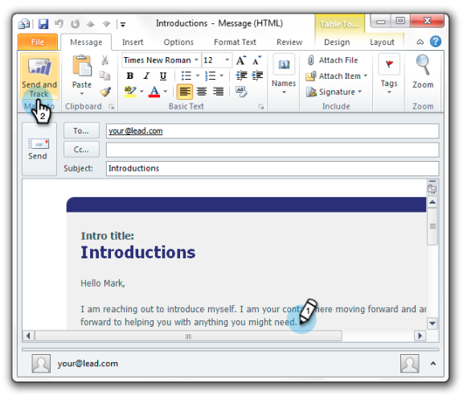

# 마케팅 템플릿을 사용하여 Outlook에서 보내기 및 추적 {#send-and-track-from-outlook-using-a-marketo-template}

마케팅 팀이 템플릿을 사용할 수 있도록 만든 경우 이메일 구성 시 이 템플릿을 사용하여 시간을 절약할 수 있습니다.

1. Microsoft Outlook을 열고 **마케팅 메시지를 클릭합니다**.

   

1. 원하는 템플릿을 선택하고 미리 본 다음 **확인을 클릭합니다**.

   

1. 모든 편집 작업을 수행한 다음 전송 및 **추적을 클릭합니다**.

   

   >[!NOTE]
   >
   >**미리 알림**
   >
   >
   >토큰은 Add-in에서 지원되지 않습니다. 템플릿에 있을 수 있는 항목을 제거합니다.

1. 미리 보기를 확인하고 제대로 작동하는지 확인한 다음 전송을 **클릭합니다**.

   

   자, 자! 멋진 마케팅 팀이 만든 템플릿을 사용하여 많은 시간을 절약할 수 있었습니다.

>[!NOTE]
>
>**관련 문서**
>
>* [리드의 인바운드 메일 로그인](../../../product-docs/marketo-sales-insight/using-msi/log-inbound-mail-from-your-leads-in-marketo.md)

>

