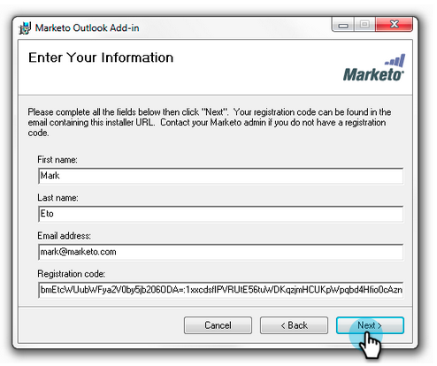
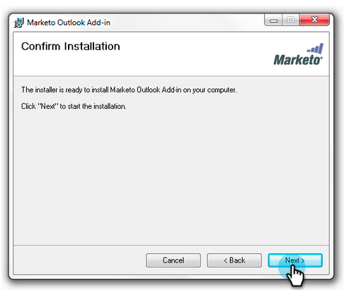

# Outlook용 Marketing To Email 추가 기능 업그레이드 {#upgrade-your-marketo-email-add-in-for-outlook}

Outlook용 Marketing To Email Add-in의 새 버전을 사용할 수 있으면 다음 지침에 따라 업그레이드하십시오.

## 설치 프로그램 다운로드 {#download-installer}

사용 중인 Microsoft Outlook 버전에 적합한 설치 프로그램을 다운로드합니다.

<table> 
 <colgroup> 
  <col> 
  <col> 
  <col> 
  <col> 
  <col> 
 </colgroup> 
 <tbody> 
  <tr> 
   <th> </th> 
   <th colspan="2">단일 사용자 초대 설치</th> 
   <th colspan="2">Enterprise 키 설치</th> 
  </tr> 
  <tr> 
   <td><strong>Outlook 버전</strong></td> 
   <td><strong>32비트</strong></td> 
   <td><strong>64비트</strong></td> 
   <td><strong>32비트</strong></td> 
   <td><strong>64비트</strong></td> 
  </tr> 
  <tr> 
   <td>Outlook 2000</td> 
   <td>지원되지 않음</td> 
   <td>해당 없음</td> 
   <td>지원되지 않음</td> 
   <td>해당 없음</td> 
  </tr> 
  <tr> 
   <td>Outlook 2003</td> 
   <td><a href="http://munchkin.marketo.net/MarketoAddInSetup32.msi" rel="nofollow">다운로드</a></td> 
   <td>해당 없음</td> 
   <td>지원되지 않음</td> 
   <td>해당 없음</td> 
  </tr> 
  <tr> 
   <td>Outlook 2007</td> 
   <td><a href="http://munchkin.marketo.net/MarketoAddInSetup32.msi" rel="nofollow">다운로드</a></td> 
   <td>해당 없음</td> 
   <td>지원되지 않음</td> 
   <td>해당 없음</td> 
  </tr> 
  <tr> 
   <td>Outlook 2010</td> 
   <td><a href="http://munchkin.marketo.net/MarketoAddInSetup32.msi" rel="nofollow">다운로드</a></td> 
   <td><a href="http://munchkin.marketo.net/MarketoAddInSetup64.msi" rel="nofollow">다운로드</a></td> 
   <td><a href="http://munchkin.marketo.net/MarketoAddInSetup32.msi" rel="nofollow">다운로드</a></td> 
   <td><a href="http://munchkin.marketo.net/MarketoAddInSetup64.msi" rel="nofollow">다운로드</a></td> 
  </tr> 
  <tr> 
   <td>Outlook 2013</td> 
   <td><a href="http://munchkin.marketo.net/MarketoAddInSetup32.msi" rel="nofollow">다운로드</a></td> 
   <td><a href="http://munchkin.marketo.net/MarketoAddInSetup64.msi" rel="nofollow">다운로드</a></td> 
   <td><a href="http://munchkin.marketo.net/MarketoAddInSetup32.msi" rel="nofollow">다운로드</a></td> 
   <td><a href="http://munchkin.marketo.net/MarketoAddInSetup64.msi" rel="nofollow">다운로드</a></td> 
  </tr> 
  <tr> 
   <td>Outlook 2016</td> 
   <td><a href="http://munchkin.marketo.net/MarketoAddInSetup32.msi" rel="nofollow">다운로드</a></td> 
   <td><a href="http://munchkin.marketo.net/MarketoAddInSetup64.msi" rel="nofollow">다운로드</a></td> 
   <td><a href="http://munchkin.marketo.net/MarketoAddInSetup32.msi" rel="nofollow">다운로드</a></td> 
   <td><a href="http://munchkin.marketo.net/MarketoAddInSetup64.msi" rel="nofollow">다운로드</a></td> 
  </tr> 
  <tr> 
   <td colspan="1">Outlook 2019</td> 
   <td colspan="1"><a href="http://munchkin.marketo.net/MarketoAddInSetup32.msi" rel="nofollow">다운로드</a></td> 
   <td colspan="1"><a href="http://munchkin.marketo.net/MarketoAddInSetup64.msi" rel="nofollow">다운로드</a></td> 
   <td colspan="1"><a href="http://munchkin.marketo.net/MarketoAddInSetup32.msi" rel="nofollow">다운로드</a></td> 
   <td colspan="1"><a href="http://munchkin.marketo.net/MarketoAddInSetup64.msi" rel="nofollow">다운로드</a></td> 
  </tr> 
  <tr> 
   <td colspan="1">Outlook O365(Windows만 해당)</td> 
   <td colspan="1"><a href="http://munchkin.marketo.net/MarketoAddInSetup32.msi" rel="nofollow">다운로드</a></td> 
   <td colspan="1"><a href="http://munchkin.marketo.net/MarketoAddInSetup64.msi" rel="nofollow">다운로드</a></td> 
   <td colspan="1"><a href="http://munchkin.marketo.net/MarketoAddInSetup32.msi" rel="nofollow">다운로드</a></td> 
   <td colspan="1"><a href="http://munchkin.marketo.net/MarketoAddInSetup64.msi" rel="nofollow">다운로드</a></td> 
  </tr> 
  <tr> 
   <td>Mac용 Outlook</td> 
   <td>지원되지 않음</td> 
   <td>지원되지 않음</td> 
   <td>지원되지 않음</td> 
   <td>지원되지 않음</td> 
  </tr> 
  <tr> 
   <td colspan="1">Outlook 웹 앱</td> 
   <td colspan="1">지원되지 않음</td> 
   <td colspan="1">지원되지 않음</td> 
   <td colspan="1">지원되지 않음</td> 
   <td colspan="1">지원되지 않음</td> 
  </tr> 
 </tbody> 
</table>

## 업그레이드 {#upgrade}

1. 설치 관리자를 실행합니다.

   

   다음을 클릭합니다.
   

   >[!NOTE]
   >
   >경우에 따라 데이터가 누락됩니다. 등록 이메일에서 복사한 다음 Outlook을 닫습니다.

1. Microsoft Outlook을 닫습니다.

   

1. 모든 정보가 미리 입력되어 있음을 알 수 있습니다. 다음을 클릭하면 **됩니다**.

   

   >[!TIP]
   >
   >설치에 실패하는 경우 IT 부서에 문의하여 HTTPS 트래픽이 차단되지 않도록 확인하십시오. 설치 프로그램을 사용하려면 HTTPS 트래픽을 열어야 합니다.

   기본 위치에 설치하려면 [다음]을 클릭합니다.

   

1. 다음을 **클릭합니다**.

   

1. 이제 설치가 완료되었습니다. 닫기를 **클릭합니다**.

   

1. 이제 Microsoft Outlook을 열어 최신 버전의 Marketing 버튼을 볼 수 있습니다.

   

>[!MORELIKETHIS]
>
>* [Outlook용 Marketing To 이메일 추가 기능을 사용하여 이메일 보내기 및 추적](send-and-track-an-email-with-the-email-add-in-for-outlook.md)
>* [마케팅 템플릿을 사용하여 Outlook에서 보내기 및 추적](send-and-track-from-outlook-using-a-marketo-template.md)

>

