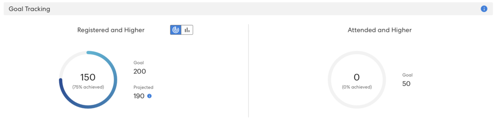
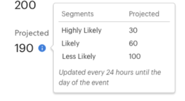
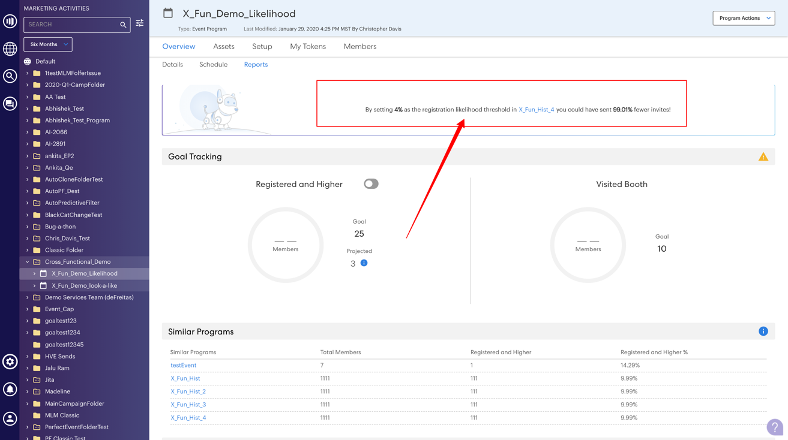
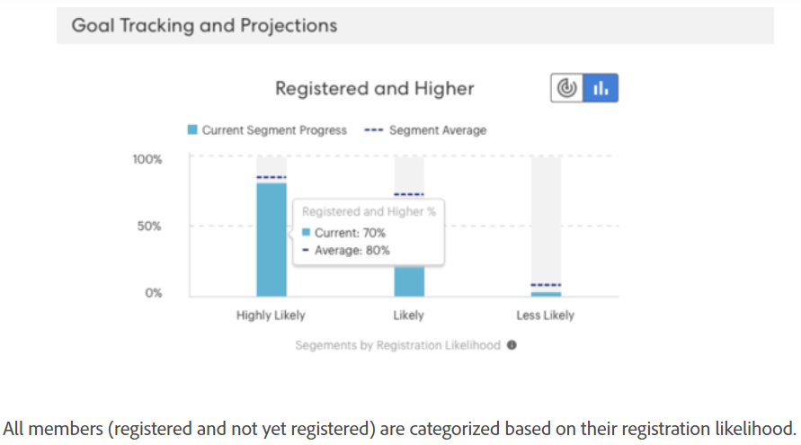

# 목표 추적 및 예상 등록 이해 {#understanding-goal-tracking-and-projected-registrations}

후 [이벤트 목표 설정](/help/marketo/product-docs/marketo-sky/setting-event-goals.md) 그리고 초대장을 통해 보내기 [스마트 캠페인](/help/marketo/product-docs/core-marketo-concepts/smart-campaigns/creating-a-smart-campaign/create-a-new-smart-campaign.md)다음은 목표 진행 상황을 추적하고 Marketo의 예측을 이해하는 방법입니다.

>[!NOTE]
>
>Marketo Classic 환경에서 이벤트 프로그램이 만들어지면 이벤트 시작 날짜는 현재 이벤트 생성 날짜로 설정됩니다. 예상 등록은 이벤트의 시작 날짜보다 시간이 오래 걸리는 것을 고려하므로 시작 날짜와 작성 날짜가 같은 경우(의도적으로 설정하지 않은 경우) 이 숫자가 정확하지 않을 수 있습니다.

## 목표 추적 및 예상 등록 {#goal-tracking-and-projected-registrations}

1. 에서 목표 추적 세부 사항을 찾을 수 있습니다 **[!UICONTROL 보고서]** 이벤트 프로그램의 탭입니다. 이 특정 예에서는 지금까지 200(75%)이라는 목표에 대해 150명의 등록된 구성원이 있습니다.

   

또한 **[!UICONTROL 투영됨]** 등록 정보 아이콘 위로 마우스를 가져가면 가능성 세그먼트별로 이 수의 분류를 볼 수 있습니다.

>[!NOTE]
>
>참석자와 상위 차트는 이벤트 날짜까지 비어 있습니다.

1. 등록 가능성별로 멤버 분류로 전환하려면 차트 전환을 누릅니다. 이전 프로그램에서 해당 세그먼트에 대한 평균 백분율과 비교하여 각 세그먼트에 대한 현재 등록 백분율이 표시됩니다.

   

모든 멤버(등록 및 아직 등록되지 않음)는 등록 가능성을 기준으로 분류됩니다. 정보 아이콘 위로 마우스를 가져가면 이러한 가능성 카테고리가 정의되는 방식을 확인할 수 있습니다.

>[!NOTE]
>
>예측 번호는 이벤트가 발생할 때까지 24시간마다 업데이트됩니다. 다음과 같이 나열된 모든 구성원 _처리 중_ 은 다음 계산 주기에 포함됩니다.

## 유사한 프로그램 {#similar-programs}

과거에 얼마나 유사한 프로그램이 수행되었는지를 확인하여 현재 이벤트에 대한 통찰력을 얻을 수 있습니다. 이 섹션에서는 지난 6개월 동안 5개의 유사한 프로그램을 보여 주고, _등록_ 또는 그 이상

유사한 프로그램을 계산할 때 다음과 같은 요소가 포함됩니다.

* 프로그램 유형
* 프로그램 채널
* 대상 크기
* 프로그램 태그
* 이벤트 생성에서 이벤트 시작까지의 시간
* 이벤트 기간

   

## Recommendations {#recommendations}

보고서 페이지 상단에서 진행 상황을 기반으로 AI/ML 기반 권장 사항을 찾을 수 있습니다. 유용한 팁과 인사이트를 정기적으로 확인하십시오!

## 개인 수준 예측 {#person-level-predictions}

을(를) 클릭합니다. **[!UICONTROL 멤버]** 탭을 눌러 모든 프로그램 구성원을 봅니다. 마우스를 위에 놓으십시오 **[!UICONTROL 등록 가능성]** 또는 **[!UICONTROL 참석 가능성]** 정확한 백분율 및 분류를 보는 막대. 그런 다음 특정 카테고리의 멤버(예: &quot;가능성이 없음&quot;에 있는 모든 구성원이 카테고리를 등록하도록 함)에 대해 조치를 취할 수 있으며, 특히 이들을 대상으로 지정하여 등록 번호를 잠재적으로 높이게 할 수 있습니다.

>[!NOTE]
>
>개별 가능성은 프로필 속성, 개인 활동 및 과거 초대/등록/참석 활동을 포함하여 40명 이상의 개인 요소를 고려합니다.

## FAQ {#faq}

**Q: 세그먼트란?**

A: 등록할 가능성이 있는 값은 0~100입니다. 이벤트 프로그램의 회원인 모든 사용자는 0에서 100 사이의 가능성 값을 받게 됩니다.

십도 값을 세 개의 세그먼트에 지정합니다.

* 등록 가능성 > 50% = 가능성이 높은 세그먼트
* 25%를 &lt;50%>로 등록할 가능성 = 세그먼트일 가능성이 있음
* &lt;25% = 가능성이 적은 세그먼트 등록 가능성

사용자가 등록 가능성을 얻으면 이러한 세그먼트 중 하나에 예측이 속합니다(프로그램의 구성원인 모든 사람이 그 세그먼트 중 하나에 속함). 예를 들어, 이벤트 프로그램에 가능성 예측을 기반으로 1000명의 멤버가 있는 경우 해당 1000이 _가능성이 높음_, _가능성이 있음_, 또는 _가능성이 적음_ 세그먼트 를 참조하십시오.

따라서 가능성이 높은 세그먼트에 속하는 사람은 이벤트에 등록할 가능성이 높습니다.

등록으로 전환 = 등록된 세그먼트의 사람 수를 세그먼트에 속하는 사람의 수로 나눈 값입니다(예: 100명이 세그먼트에 속하고 이 중 60명이 등록하면 전환율이 60%).

등록할 전환 비율은 다음 패턴을 따릅니다. 가능성이 높거나 가능성이 낮음

**Q: 인사이트를 사용하려면 어떻게 해야 합니까?**

A: 우수 사례에는 다음이 포함됩니다.

나. 프로그램을 만든 다음 스마트 캠페인이 &quot;X보다 큼&quot;을 사용하는 예측 필터를 사용하여 특정 사람(예: 1000명)을 발생시키고 캠페인을 실행합니다.

ii. 24시간 후, [!UICONTROL 보고서] 탭에서는 현재 초대된 모든 사람의 값을 등록할 가능성을 기준으로 계산된 예상 등록을 볼 수 있습니다.

3. 예상 등록 수가 목표보다 적으면 더 많은 사람을 초대해야 합니다. 이 시점에서 이전 프로그램에서 적용된 임계값이 무엇인지 알려주는 통찰력을 볼 수 있습니다.

4. 해당 임계값을 사용하여 새 스마트 캠페인을 만들어 더 많은 사용자를 초대할 수 있습니다.

v. 예상 숫자가 표시되는 이유를 이해하려는 경우 언제든지 세그먼트 간 대상 분배, 과거 전환율 등을 볼 수 있도록 전환하고 현재 대상자에 해당 전환율을 적용할 수 있습니다(아래 스크린샷 참조).

**Q: 등록별 세그먼트 그래프란?**

A: 각각 세그먼트를 나타내는 3개의 막대(가능성이 높음, 가능성이 낮음)입니다.

**자주색 점선:** 과거 유사한 프로그램을 기반으로 하여 해당 세그먼트의 등록에 대한 평균 대화 비율입니다.

**파란색 막대:** 해당 세그먼트에 있는 모든 사람의 등록 비율입니다.

예를 들어 100명이 등록된 100명 중 50% 이상, 60명 이상이 등록될 가능성이 있다고 가정해 보겠습니다. 전환 가능성이 높습니다. 따라서 프로그램에 추가된 모든 구성원이 값을 등록할 가능성이 높아지면 세그먼트로 배치되며 각 세그먼트 전환율에 등록된 사람 수에 따라 계산됩니다.

**Q: 등록 및 이상 항목은 무엇을 의미합니까?**

A: 등록됨으로 나열되는 사람 또는 동일한 단계 이상의 기타 모든 상태.

이벤트 프로그램에 대해 새 진행 상태를 만들 수 있지만 표준 상태에 매핑합니다. 사람이 초대받은 상태에서 다시 상기되도록 이동하는 경우를 생각해 보십시오. 이는 등록보다 높은 단계입니다. 또한 이 사람은 등록으로 간주되어 목표 추적에 표시됩니다.

**Q: 예상 등록은 어떻게 계산됩니까?**

A: 아래를 참조하십시오.

