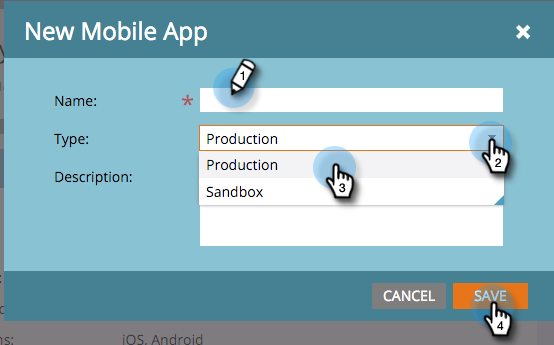

# 모바일 앱 추가 {#add-a-mobile-app}

모바일 앱을 Marketing To와 연결하여 푸시 알림을 고객 기반에 전송합니다.

앱은 일반적으로 초기 개발 및 테스트가 수행되는 샌드박스 환경에서 시작됩니다. 그런 다음 개발자는 프로덕션 환경을 사용하여 고객이 사용할 최종 앱을 빌드합니다. 모바일 앱을 추가할 때 적절한 알림 인증서를 선택해야 합니다(아래 4단계 참조).

>[!NOTE]
>
>**가용성**
>
>모든 고객이 이 기능을 구입하지는 않았습니다. 자세한 내용은 영업 담당자에게 문의하십시오.

1. 관리자를 **클릭합니다**.

   

1. *** 모바일 앱 및 디바이스**를 클릭합니다.

   

   새 모바일 앱을 클릭합니다.

   

1. 이름을 입력합니다. 유형 **** 드롭다운에서 사용 중인 환경 유형(샌드박스 또는 프로덕션)을 선택합니다. 저장을 **클릭합니다**.

   

   >[!NOTE]
   >
   >프로덕션 환경에서 프로덕션 알림 인증서를 사용하는 것이 좋습니다. 샌드박스 인증서는 프로덕션 환경에 문제 없이 설치되지만 알림을 수신하지는 않습니다. 환경 또는 알림 인증서에 대한 질문이 있는 경우 Marketing To Admin 또는 Mobile Apps Developer에 문의하십시오.

   좋아! 이제 Android 및 iOS 장치에서 작동하도록 앱을 구성합니다.

>[!MORELIKETHIS]
>
>* [모바일 앱 Android 푸시 액세스 구성](configure-mobile-app-android-push-access.md)
>* [모바일 앱 iOS 푸시 액세스 구성](configure-mobile-app-ios-push-access.md)

>

