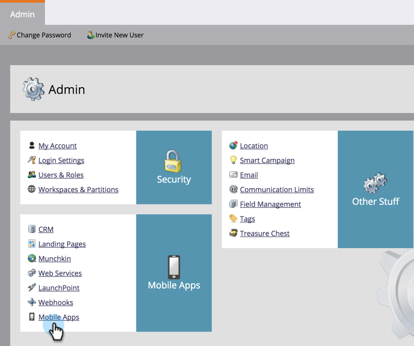

# 모바일 앱 Android 푸시 액세스 구성 {#configure-mobile-app-android-push-access}

1. **[!UICONTROL Admin]**&#x200B;를 클릭합니다.

   

1. **[!UICONTROL Mobile Apps]**&#x200B;를 선택합니다.

   

1. 원하는 모바일 앱을 선택합니다.

   

1. **[!UICONTROL Push Access Type]**&#x200B;에서 **[!UICONTROL Android]**&#x200B;를 선택하고 **[!UICONTROL Configure]**&#x200B;를 클릭합니다.

   

   >[!NOTE]
   >
   >모바일 앱 개발자의 **[!UICONTROL Server API Key]** 및 **[!UICONTROL Project Number]**&#x200B;이(가) 필요합니다. 개발자는 [!DNL Google Play Developer Console]에 로그인하여 앱을 등록하고 클라우드 메시지를 활성화하여 이러한 정보를 수신합니다.

1. [!UICONTROL Server API Key] 및 [!UICONTROL Project Number]을(를) 입력하십시오. **[!UICONTROL Save]**&#x200B;를 클릭합니다.

   

   잘됐네 [!UICONTROL iOS]&#x200B;(으)로 앱을 구성했는지 확인하십시오.

>[!MORELIKETHIS]
>
>[모바일 앱 iOS 푸시 액세스 구성](/help/marketo/product-docs/mobile-marketing/admin/configure-mobile-app-ios-push-access.md)
