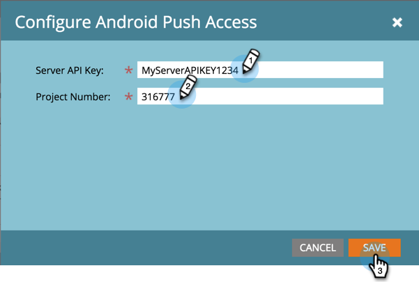

# 모바일 앱 Android 푸시 액세스 구성 {#configure-mobile-app-android-push-access}

1. 관리자를 **클릭합니다**.

   

1. 모바일 앱 **을 선택합니다**.

   

   원하는 모바일 앱을 선택합니다.

   

1. [ **푸시 액세스 유형**]에서 **Android를** 선택하고 구성을 **클릭합니다.**

   

   >[!NOTE]
   >
   >모바일 앱 개발자로부터 **서버 API 키** 및 **프로젝트 번호** 가 필요합니다. 개발자는 Google Play 개발자 콘솔에 로그인하여 앱을 등록하고 클라우드 메시지를 활성화함으로써 이러한 메시지를 받습니다.

   서버 API 키와 프로젝트 번호를 입력합니다. 저장을 클릭합니다.

   

   달콤해 iOS를 사용하여 앱을 구성해야 합니다.

>[!MORELIKETHIS]
>
>* [모바일 앱 iOS 푸시 액세스 구성](configure-mobile-app-ios-push-access.md)

>

