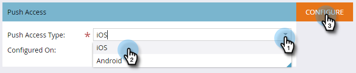

# 모바일 앱 iOS 푸시 액세스 구성 {#configure-mobile-app-ios-push-access}

1. 관리자를 클릭합니다.

   

1. 모바일 앱을 선택합니다.

   

1. 원하는 모바일 앱을 선택합니다.

   

1. [푸시 액세스 유형]에서 iOS를 선택하고 [구성]을 클릭합니다.

   

   >[!NOTE]
   >
   >모바일 앱 개발자의 **인증서** 및 **암호**&#x200B;가 필요합니다. 개발자는 Apple Developer Member Center에 로그인하여 앱에 대한 푸시 알림 인증서를 설정 및 다운로드하고 콘텐츠를 내보내어 이러한 인증서를 받습니다. 개발자가 내보낼 때 암호를 설정합니다. **중요**:인증서는 샌드박스 또는 프로덕션 등 사용 중인 환경에 적합해야 합니다. Marketing To Admin 또는 모바일 앱 개발자로 확인하십시오.

1. 인증서를 선택하고 암호를 입력한 다음 저장을 클릭합니다.

   

훌륭합니다! Android로 앱을 구성해야 합니다.

>[!MORELIKETHIS]
>
>* [모바일 앱 Android 푸시 액세스 구성](configure-mobile-app-android-push-access.md)

>

