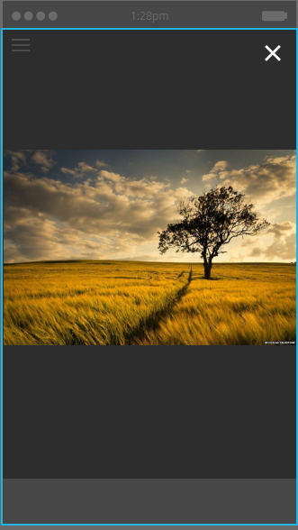

# 인앱 메시지의 레이아웃 선택 {#choose-a-layout-for-your-in-app-message}

Marketo은 인앱 메시지 작성을 위한 6개의 레이아웃을 제공합니다.

* 팝업 레이아웃은 더 전통적인 방식으로, 콘텐츠를 제공할 크리에이티브 팀이 없고 특정 모양과 느낌이 필요하지 않은 경우 이상적입니다. Marketo 내에서 나만의 인앱 메시지를 쉽게 만들고 편집할 수 있습니다
* 전체 화면 레이아웃을 사용하면 완성된 디자인을 가져올 수 있으므로 그래픽 유연성이 완벽합니다

## 팝업 레이아웃 {#pop-up-layouts}

세 개의 팝업 레이아웃은 모두 이미지, 텍스트, 단추 및 배경을 포함한 사전 설정된 디자인 요소를 제공합니다.

첫 번째 팝업 레이아웃은 대부분의 용도에 맞는 적절한 이유로 기본 선택 사항입니다. 저해상도 이미지에서는 잘 작동합니다. 이 레이아웃은 플랫폼에 표준 글꼴(Apple의 경우 Helvetica, Android의 경우 Roboto)을 사용하므로 항상 휴대 전화 또는 태블릿에서 올바르게 표시됩니다. 기본 및 배경 이미지를 업로드 및 배치하고, 고유한 기본 및 지원 텍스트를 작성하고, 기본 및 닫기 단추를 구성할 수 있습니다. 텍스트는 24픽셀에서 세 줄로 제한됩니다. 문자 크기가 클수록 선 수가 줄어듭니다.

두 번째 팝업 레이아웃은 텍스트 상자를 제거하여 더 큰 이미지를 위한 공간을 더 많이 제공합니다. 선택한 스타일의 텍스트를 가져오기 전에 이미지에 추가하여 사용자 정의 모양을 만듭니다.

세 번째 팝업 레이아웃은 인앱 메시지에 이미지를 사용할 필요가 없는 경우 유용합니다. 두 개의 버튼을 사용하면 메시지 수신자에게 작업을 선택할 수 있습니다. 텍스트는 세 줄로 제한됩니다. 문자 크기가 클수록 사용 가능한 줄 수가 줄어듭니다.

## 전체 화면 레이아웃 {#full-screen-layouts}

3개의 전체 화면 스타일 레이아웃은 완료된 그래픽 아트워크를 가져올 수 있도록 디자인되었습니다. 원하는 글꼴을 선택하고 그래픽 내에 포함시켜 웹 페이지나 프로모션과 일치시킵니다.

첫 번째 전체 화면 레이아웃은 빈 캔버스를 제공합니다. 이 화면은 이미지를 늘리거나 자르지 않고 업로드한 내용을 정확하게 표시합니다(아래 예 참조). 이 모양은 이미지 모양에 따라 크기가 작아져 주위에 빈 영역이 남게 됩니다. 이미지의 어떤 부분도 제거되지 않습니다.

이 가로 이미지는 가로 이미지의 전체 폭을 표시하고 위쪽과 아래쪽을 공백으로 둡니다.

두 번째 전체 화면 레이아웃은 텍스트 필드와 단추를 추가합니다.

첫 번째 전체 화면 레이아웃과 달리 이 레이아웃은 세 번째 전체 화면 레이아웃(아래)과 함께 배치된 이미지를 전체 높이에 맞게 확장하고 측면을 트림합니다. 원본 이미지에 따라 매력적인 배경 이미지가 생성될 수 있습니다. 이 예에서는 위에 표시된 이미지와 동일한 이미지를 사용합니다.

세 번째 전체 화면 레이아웃은 두 번째 버튼을 제외하고 두 번째 버튼과 동일합니다. 메시지 수신자를 위한 추가 옵션을 제공합니다.

이제 템플릿에 대해 알았으므로 [인앱 메시지 이미지를 만들](/help/marketo/product-docs/mobile-marketing/in-app-messages/creating-in-app-messages/add-in-app-message-images.md) 때 하나를 선택해야 합니다.

>[!MORELIKETHIS]
>
>[인앱 메시지 이해](/help/marketo/product-docs/mobile-marketing/in-app-messages/understanding-in-app-messages.md)
