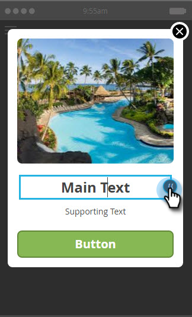

# 인앱 메시지 텍스트 만들기 {#create-in-app-message-text}

텍스트 스타일 및 콘텐츠를 작업하려면 텍스트 영역을 클릭합니다.

>[!CAUTION]
>
>현재는 이모지가 완전히 지원되지 않으므로 텍스트에서 이모지를 사용하지 않는 것이 좋습니다.

1. 인라인 편집하려면 주 텍스트를 클릭하십시오.

   

1. 텍스트 색상을 클릭하거나 색상 선택기에서 16진수 또는 RGB 번호를 입력하여 선택합니다.

   

1. 화살표를 클릭하여 텍스트 크기를 선택합니다.

   

   >[!CAUTION]
   >
   >텍스트 크기가 너무 크면 컨텐츠가 보이는 최대 3개의 텍스트 줄을 초과할 수 있습니다.

1. 선택적 형식 스타일을 선택하십시오. 강조할 형식: **굵게**, _기울임꼴_ 또는 밑줄.

   

1. 텍스트 정렬: 왼쪽, 가운데, 오른쪽 가운데가 기본값입니다.

   

   >[!NOTE]
   >
   >광고에 렌더링되는 텍스트 글꼴은 각 플랫폼에 대한 표준 글꼴입니다(Apple의 경우 Helvetica, Android의 경우 Roboto)

1. 텍스트 탭 작업을 선택하려면 상자를 선택합니다.

   

1. 각 플랫폼(Apple 또는 Android)에 대해 탭 작업을 선택합니다.

   

   >[!NOTE]
   >
   >탭 작업의 경우 Apple 및 Android 플랫폼에 대해 다양한 작업을 설정할 수 있습니다. 예를 들어 딥링크는 Apple 및 Android에서 다르게 처리됩니다. 메시지가 한 플랫폼 또는 다른 플랫폼으로만 이동하는 경우 다른 플랫폼은 기본 설정에 두거나 없음을 선택할 수 있습니다.

1. 인라인 편집하려면 지원 텍스트를 클릭하십시오. 기본 텍스트를 편집하는 것과 같은 방식으로 작동하지만 기본 텍스트 크기는 더 작습니다.

   

1. Main 또는 Supporting 텍스트에 대해 Token 아이콘을 클릭하여 토큰을 추가합니다.

   

1. 드롭다운에서 [내 토큰]을 선택하고 기본값을 추가한 다음 **삽입**&#x200B;을 클릭합니다.

   

   >[!NOTE]
   >
   >내 토큰만 옵션으로 사용할 수 있습니다. 프로그램에 내 토큰이 설정되지 않은 경우 토큰 드롭다운이 비어 있습니다.

   >[!TIP]
   >
   >대상자가 토큰을 볼 때 토큰으로 확인할 문자의 길이를 고려해야 합니다. 더 긴 값을 고려하여 잘리지 않도록 충분한 공간을 둡니다.

   승인된 인앱 메시지 프로그램에서 사용된 토큰에 대한 변경 사항은 프로그램이 일시 중지되었다가 다시 시작될 때까지 인앱 메시지에 적용되지 않습니다.

넌 금덩이야 [인앱 메시지 단추를 설정](/help/marketo/product-docs/mobile-marketing/in-app-messages/creating-in-app-messages/set-up-the-in-app-message-button.md)해야 합니다.

>[!MORELIKETHIS]
>
>* [인앱 메시지 이해](/help/marketo/product-docs/mobile-marketing/in-app-messages/understanding-in-app-messages.md)
>* [인앱 메시지의 레이아웃을 선택하십시오](/help/marketo/product-docs/mobile-marketing/in-app-messages/creating-in-app-messages/choose-a-layout-for-your-in-app-message.md)
