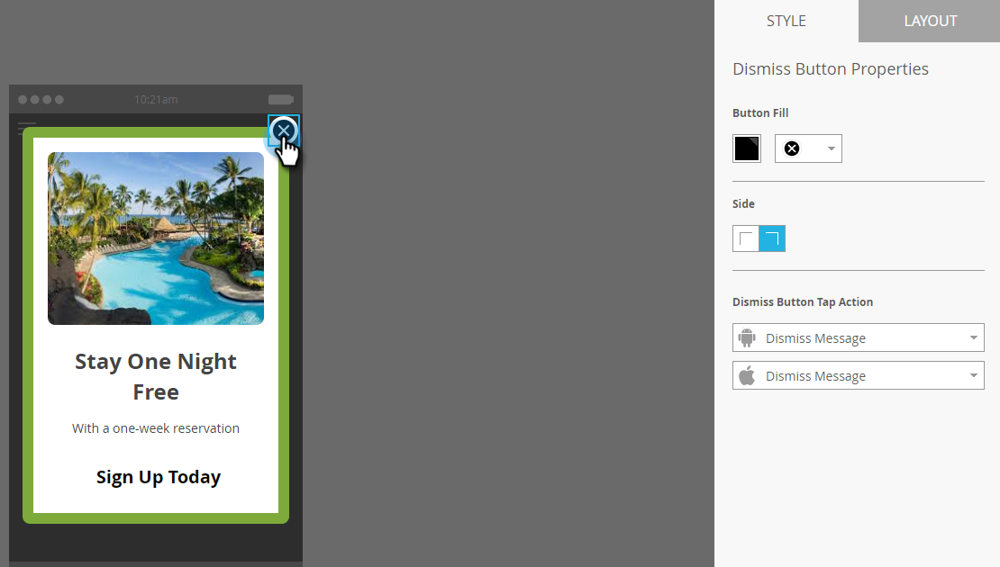

# 해제 단추 설정 및 메시지 승인 {#set-up-the-dismiss-button-and-approve-the-message}

## 해제 단추 속성 구성  {#configure-dismiss-button-properties}

[해제] 단추에는 원하는 방식으로 구성할 수 있는 여러 가지 옵션이 있습니다.

1. 편집기에서 [해제] 단추를 클릭합니다.

   

1. 단추 색상을 변경하려면 색상 선택 사각형을 클릭합니다. 색상을 클릭하거나 색상 피커에서 16진수 또는 RGB 번호를 입력하여 선택합니다. 기본값은 검정입니다.

   

1. 드롭다운에서 단추 디자인을 선택합니다. 라운드 버튼에는 전체 색상 및 그라디언트 옵션이 포함되어 있습니다.

   

   >[!CAUTION]
   >
   >드롭다운에서 다른 디자인을 선택하면 단추 색상이 흰색 배경에 흰색 X로 표시될 수 있습니다. 그런 경우 색상 선택 사각형의 검정색 또는 다른 색상을 선택하여 흰색 X를 표시합니다.

1. 왼쪽 모퉁이 단추를 클릭하여 닫기 단추를 왼쪽으로 이동할 수 있습니다(오른쪽이 기본값임).

   

1. 각 플랫폼에 대한 드롭다운을 클릭하고 해제 단추에 대한 탭 작업을 선택합니다.

   

   >[!NOTE]
   >
   >[해제] 단추를 탭 동작으로 지정해야 사용할 확인란이 없습니다. 메시지 해지가 기본(및 명백한) 선택입니다.

## 포장해 주세요 {#wrap-it-up}

그래픽, 텍스트 및 단추에 대한 모든 선택 사항이 자동으로 저장되었습니다. 이제 일을 끝낼 준비가 됐군요

1. 인앱 메시지를 미리 보려면 **메시지 작업** 드롭다운을 클릭하고 미리 보기를 **선택합니다**.

   

1. 스마트폰 또는 태블릿에서 인앱 메시지를 미리 보고 올바르게 표시되는지 확인합니다.

   

1. 인앱 메시지가 마음에 들면 승인 및 **닫기를 클릭합니다**.

   

   >[!NOTE]
   >
   >메시지 작업 드롭다운(1단계 참조) **에서** 직접 승인 및 닫기를 선택할 수도 있지만, 안전하게 하기 위해 먼저 메시지를 미리 보는 것은 어떨까요?

1. 승인하지 않고 편집기를 닫으려면 탭을 닫기만 하면 됩니다. 자동 저장되므로 나중에 반환하고 승인할 수 있습니다.

   

다양한 옵션을 선택할 수 있지만 이제 앱 내에서 멋진 메시지를 확인할 수 있습니다.

이제 메시지를 [보낼 때입니다](http://docs.marketo.com/display/docs/send+your+in-app+message).

>[!MORELIKETHIS]
>
>* [인앱 메시지 이해](../../../../product-docs/mobile-marketing/in-app-messages/understanding-in-app-messages.md)
>* [인앱 메시지 보내기](http://docs.marketo.com/display/docs/send+your+in-app+message)
>* [인앱 메시지에 사용할 레이아웃 선택](choose-a-layout-for-your-in-app-message.md)

>

