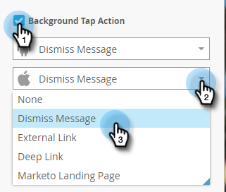

# 인앱 메시지 배경 {#set-up-the-in-app-message-background} 설정

메시지 배경을 선택하는 것은 인앱 메시지를 완료하는 데 중요한 단계입니다.

>[!TIP]
>
>배경 이미지, 텍스처 및 그레이디언트가 일반적으로 가장 잘 작동합니다.

1. 편집기에서 배경 영역을 클릭합니다.

   

1. 색상을 설정하려면 **색상**&#x200B;을 클릭한 다음 색상 선택 사각형을 클릭합니다. 색상을 클릭하거나 색상 피커에서 16진수 또는 RGB 코드를 입력하여 색상을 선택합니다.

   

   >[!NOTE]
   >
   >기본값인 흰색은 일반적으로 우승자입니다.

1. 배경을 사용하려면 **이미지**&#x200B;를 클릭한 다음 **이미지 선택** 링크를 클릭합니다.

   

1. Design Studio에 업로드된 파일 중에서 선택합니다. **선택**&#x200B;을 클릭합니다.

   

   >[!NOTE]
   >
   >이미지 크기는 1440 x 2560px 및 5MB로 제한됩니다.

1. 결과를 평가합니다. 승_Maybe a plain color, texture, or gradient will work better!

   

1. 이미지 테두리(선택 사항)를 적용합니다. 기본 설정은 **Off**&#x200B;입니다. 먼저 색상을 클릭하거나 색상 피커에서 16진수 또는 RGB 번호를 입력하여 색상을 선택합니다.

   

1. 화살표를 클릭하여 테두리 폭을 변경합니다. 이 12픽셀의 녹색 테두리는 인앱 메시지 모양을 변경합니다.

   

1. 슬라이더를 사용하여 모퉁이 반경을 선택합니다. 왼쪽에서 오른쪽으로 위치를 선택합니다.0, 4, 8, 12 또는 16픽셀 8픽셀(가운데) 선택 영역이 기본값입니다.

   

1. 이 확인란을 선택하여 배경 탭 작업을 설정합니다(기본적으로 꺼짐).

   

   >[!NOTE]
   >
   >배경에 대한 탭 작업의 경우 Apple 및 Android 플랫폼에 대해 다른 작업을 설정할 수 있습니다. 예를 들어 딥 링크는 Apple 및 Android에 대해 다르게 처리됩니다. 메시지가 한 플랫폼 또는 다른 플랫폼으로만 이동하는 경우 다른 플랫폼을 기본 설정에 그대로 두거나 **없음**&#x200B;을 선택합니다.

   [해제 단추 설정](set-up-the-dismiss-button-and-approve-the-message.md)

   >[!NOTE]
   >
   >**관련 문서**
   >
   >    
   >    
   >    * [인앱 메시지 이해](../../../../product-docs/mobile-marketing/in-app-messages/understanding-in-app-messages.md)
   >    * [인앱 메시지 보내기](http://docs.marketo.com/pages/viewpage.action?pageid=10617378)
   >    * [인앱 메시지에 사용할 레이아웃 선택](choose-a-layout-for-your-in-app-message.md)

이 일을 마치려면 마지막 단계는 .