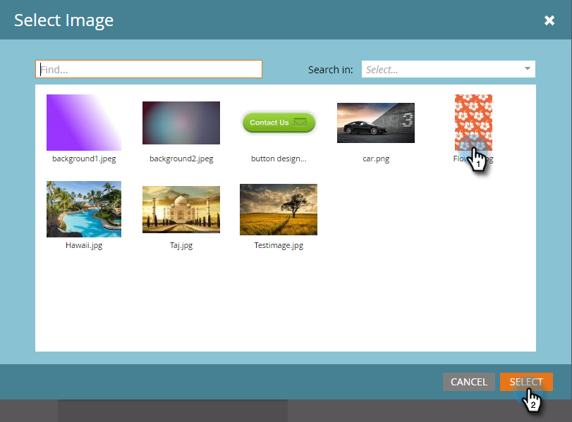

# 인앱 메시지 배경 설정 {#set-up-the-in-app-message-background}

메시지 배경을 선택하는 것은 인앱 메시지를 완료하는 중요한 단계입니다.

>[!TIP]
>
>배경 이미지의 경우 텍스처 및 그라디언트가 일반적으로 가장 잘 작동합니다.

1. 편집기에서 배경 영역을 클릭합니다.

   

1. 색상을 설정하려면 **색상**&#x200B;그런 다음 색상 선택 사각형을 선택합니다. 색상을 클릭하거나 색상 선택기에 16진수 또는 RGB 코드를 입력하여 선택합니다.

   

   >[!NOTE]
   >
   >기본값인 보통 흰색은 승자입니다.

1. 배경을 사용하려면 **이미지** 그리고 **이미지 선택** 링크를 클릭합니다.

   

1. Design Studio에 업로드된 파일 중에서 선택합니다. 클릭 **선택**.

   

   >[!NOTE]
   >
   >이미지 크기는 1440 x 2560px 및 5MB로 제한됩니다.

1. 결과를 평가합니다. 이런-어쩌면 일반 색상, 텍스처, 그라데이션 등이 더 잘 될 것 같습니다!

   

1. 선택적 이미지 테두리를 적용합니다. 기본 설정은 다음과 같습니다 **해제**. 먼저 색상을 클릭하거나 색상 선택기에 16진수 또는 RGB 번호를 입력하여 선택합니다.

   

1. 테두리 폭을 변경하려면 화살표를 클릭합니다. 이 12픽셀 범위의 녹색 테두리는 인앱 메시지의 모양을 변경합니다.

   

1. 슬라이더를 사용하여 모퉁이 반경을 선택합니다. 왼쪽에서 오른쪽으로 위치를 선택합니다. 0, 4, 8, 12 또는 16픽셀 기본적으로 8픽셀(가운데) 선택이 사용됩니다.

   

1. 백그라운드 탭 작업을 설정하려면 상자를 선택합니다(기본적으로 꺼져 있음).

   

   >[!NOTE]
   >
   >배경에 대한 탭 작업의 경우 Apple 및 Android 플랫폼에 대해 서로 다른 작업을 설정할 수 있습니다. 예를 들어 딥 링크는 Apple 및 Android에서 다르게 처리됩니다. 메시지가 한 플랫폼 또는 다른 플랫폼에만 이동되는 경우 기본 설정에서 다른 플랫폼 또는 를 선택하거나 선택합니다 **없음**.

   작업을 마치려면 마지막 단계는 다음과 같습니다 [해제 단추 설정](/help/marketo/product-docs/mobile-marketing/in-app-messages/creating-in-app-messages/set-up-the-dismiss-button-and-approve-the-message.md).

   >[!MORELIKETHIS]
   >
   >* [인앱 메시지 이해](/help/marketo/product-docs/mobile-marketing/in-app-messages/understanding-in-app-messages.md)
   >* [인앱 메시지 보내기](/help/marketo/product-docs/mobile-marketing/in-app-messages/sending-your-in-app-message/send-your-in-app-message.md)
   >* [인앱 메시지의 레이아웃 선택](/help/marketo/product-docs/mobile-marketing/in-app-messages/creating-in-app-messages/choose-a-layout-for-your-in-app-message.md)

