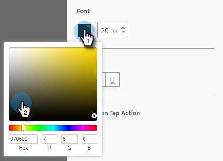

# 인앱 메시지 단추 설정 {#set-up-the-in-app-message-button}

기본 단추 디자인을 사용하거나, 수정하거나, 자신만의 사용자 지정 단추 이미지를 업로드할 수 있습니다.

1. 버튼을 클릭하여 편집할 스타일 탭을 엽니다.

   

1. 표준 단추의 색상을 변경하려면 **색상** 버튼을 클릭합니다.

   

1. 색상 선택 사각형을 클릭하고 단추 색상을 클릭하거나 색상 선택기에서 16진수 또는 RGB 번호를 입력하여 선택합니다.

   

1. 드롭다운에서 셰이프를 선택합니다. 표준 모양에는 예리한 코너, 둥근 모서리 및 그라디언트가 있습니다.

   

1. 단추에 대해 자체 이미지를 사용하려면 이미지 단추를 클릭하고 **이미지 선택**.

   

1. 이미지를 선택하고 을(를) 클릭합니다 **선택**.

   

   >[!TIP]
   >
   >단추에 대한 사용자 지정 이미지를 배치할 때 이미지에 이미 텍스트가 포함되어 있는 경우 해당 단추 위에 배치된 자리 표시자 텍스트를 지우는 것이 좋습니다.

1. 색상 선택 사각형을 클릭하고 글꼴 색상을 클릭하거나 색상 선택기에서 16진수 또는 RGB 번호를 입력하여 선택합니다.

   

1. 화살표를 클릭하여 글꼴 크기를 선택합니다.

   

1. 강조할 글꼴 스타일 선택: **굵게**, _기울임체_, 또는 밑줄.

   

1. 단추 텍스트를 클릭하여 인라인으로 편집합니다.

   

1. 단추 탭 작업을 설정하려면 상자를 선택합니다.

   

1. 각 플랫폼에 대한 드롭다운을 클릭하고 탭 작업을 선택합니다.

   

   >[!NOTE]
   >
   >버튼에는 항상 탭 작업이 있으므로 &quot;메시지 해제&quot;라는 기본 메시지와 함께 작업 탭 확인란이 자동으로 선택됩니다.

거의 다 됐어 마지막 단계는 [인앱 메시지 배경 구성 및 해제 단추](/help/marketo/product-docs/mobile-marketing/in-app-messages/creating-in-app-messages/set-up-the-in-app-message-background.md).

>[!MORELIKETHIS]
>
>* [인앱 메시지 이해](/help/marketo/product-docs/mobile-marketing/in-app-messages/understanding-in-app-messages.md)
>* [인앱 메시지의 레이아웃 선택](/help/marketo/product-docs/mobile-marketing/in-app-messages/creating-in-app-messages/choose-a-layout-for-your-in-app-message.md)

