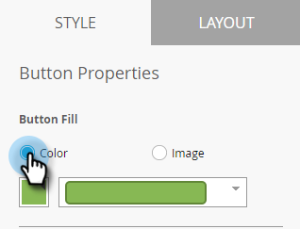

# 인앱 메시지 단추 설정 {#set-up-the-in-app-message-button}

기본 단추 디자인을 사용하거나 수정하거나 사용자 지정 단추 이미지를 업로드할 수 있습니다.

1. 편집할 [!UICONTROL Style] 탭을 열려면 단추를 클릭하십시오.

   

1. 표준 단추의 색을 변경하려면 **[!UICONTROL Color]** 단추를 클릭하십시오.

   

1. 색상 선택 사각형을 클릭하고 단추 색상을 클릭하거나 색상 선택기에서 16진수 또는 RGB 번호를 입력하여 선택합니다.

   

1. 드롭다운에서 모양을 선택합니다. 표준 모양 옵션에는 예리한 모서리, 둥근 모서리 및 그라디언트가 포함됩니다.

   

1. 단추에 사용자 이미지를 사용하려면 **[!UICONTROL Image]** 단추를 클릭하고 **[!UICONTROL Select Image]**&#x200B;을(를) 클릭합니다.

   

1. 이미지를 선택하고 **[!UICONTROL Select]**&#x200B;을(를) 클릭합니다.

   

   >[!TIP]
   >
   >단추에 대한 사용자 지정 이미지를 배치할 때 이미지에 이미 텍스트가 포함되어 있는 경우 위에 배치된 자리 표시자 텍스트를 지우는 것이 좋습니다.

1. 색상 선택 사각형을 클릭한 다음 글꼴 색상을 클릭하거나 색상 선택기에서 16진수 또는 RGB 번호를 입력하여 선택합니다.

   

1. 화살표를 클릭하여 글꼴 크기를 선택합니다.

   

1. 강조할 글꼴 스타일을 선택하십시오. **굵게**, _기울임꼴_ 또는 밑줄.

   

1. 단추 텍스트를 클릭하여 인라인으로 편집합니다.

   

1. 버튼 누르기 작업을 설정하려면 상자를 선택합니다.

   

1. 각 플랫폼에 대한 드롭다운을 클릭하고 탭 작업을 선택합니다.

   

   >[!NOTE]
   >
   >단추에는 항상 누르기 작업이 있으므로 [누르기 작업] 확인란이 자동으로 선택됩니다. 기본 메시지는 &quot;[!UICONTROL Dismiss Message]&quot;입니다.

거의 다 됐어 마지막 단계는 [인앱 메시지 배경을 구성하고 ](/help/marketo/product-docs/mobile-marketing/in-app-messages/creating-in-app-messages/set-up-the-in-app-message-background.md) 단추를 해제하는 것입니다.

>[!MORELIKETHIS]
>
>* [인앱 메시지 이해](/help/marketo/product-docs/mobile-marketing/in-app-messages/understanding-in-app-messages.md)
>* [내 [!UICONTROL In-App Message]](/help/marketo/product-docs/mobile-marketing/in-app-messages/creating-in-app-messages/choose-a-layout-for-your-in-app-message.md)의 레이아웃 선택
