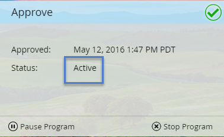

# 인앱 메시지 승인 {#approve-your-in-app-message}

인앱 메시지가 종료되기 전에 전송을 승인해야 합니다.

1. 모든 것이 정상인 경우 **승인 및 시작**&#x200B;을 클릭합니다.

   

   >[!NOTE]
   >
   >보내기 프로세스의 일부가 불완전합니다. 예를 들어 인앱 메시지가 승인되지 않으면 주의해야 할 영역을 나타내는 경고 메시지가 표시됩니다. 문제를 수정하면 2단계에서 메시지가 표시됩니다.

1. **승인 및 시작**&#x200B;을 클릭합니다.

   

1. 사용자 정의 필드를 사용한 경우 Marketing To를 실행하는 데 시간이 오래 걸릴 수 있으며 대신 이 메시지를 표시합니다.

   

1. 이제 메시지가 활성 상태입니다.

   

   >[!NOTE]
   >
   >승인된 인앱 메시지가 프로그램의 방문자에게 표시되는 데에는 일반적으로 15~30분이 소요됩니다. 사용자 정의 필드를 사용한 경우 몇 시간 또는 그 시간이 걸릴 수 있습니다.

   활성 프로그램을 일시 중지하거나 중지할 수 있지만 두 옵션 간에는 큰 차이가 있습니다.

1. 잠시 동안 프로그램을 중지했다가 나중에 다시 시작해야 하는 경우 **프로그램 일시 중지**&#x200B;를 클릭합니다. **일시 중지됨** 상태로 변경됩니다.

   

   >[!NOTE]
   >
   >일시 중지해야 하는 이유는 잠시 동안 중지하거나 메시지를 수정하거나 일정을 조정할 수 있습니다. 그러나 다른 메시지로 변경할 수는 없으며 기존 메시지만 편집합니다.

1. 일시 중지된 프로그램을 계속 실행하려면 **다시 시작** **프로그램**&#x200B;을 클릭합니다.

   

1. 프로그램을 완전히 중지하려면 **프로그램 중지**&#x200B;를 클릭합니다.

   

1. 프로그램을 중지하려면 **중지**&#x200B;를 클릭합니다.

   ** 

   **

   >[!NOTE]
   >
   >프로그램을 중지하면 더 이상 실행되지 않고 다시 시작할 수 없습니다. 다시 실행하려면 다시 설치해야 합니다. 그러므로 **프로그램 중지**&#x200B;를 클릭하기 전에 프로그램 작업이 완료되었는지 확인합니다.

## 인앱 대시보드 {#in-app-dashboard}

프로그램이 실행된 후 프로그램 승인 후 자동으로 나타나는 인앱 대시보드로 프로그램의 성능을 모니터링할 수 있습니다. 프로그램으로 돌아가려면 오른쪽 상단의 링크를 클릭하고 **Campaign 컨트롤 패널**&#x200B;을 선택합니다.

그게 다예요!

