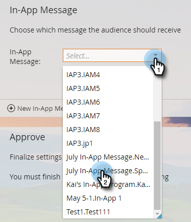

# 인앱 메시지 선택 {#select-your-in-app-message}

여기에서 프로그램에서 사용할 메시지를 선택합니다.

1. 드롭다운에서 인앱 메시지를 선택합니다.

   

   >[!NOTE]
   >
   >모든 메시지는 자신의 위치에 상관없이 선택할 수 있습니다. Marketing to applying the parent name to each one, to sure each file receive a unique name.

1. 메시지를 선택한 후 준비가 되었습니다. 편집하거나 미리 볼 수 있습니다.

   

   >[!TIP]
   >
   >다른 메시지를 선택하려면 인앱 메시지 필드에서 삭제합니다. 그러면 새 인앱 메시지 링크가 다시 표시됩니다. 클릭하고 다른 메시지를 선택합니다.

당신 말이 맞아요 전송을 [예약하는 시간입니다](/help/marketo/product-docs/mobile-marketing/in-app-messages/sending-your-in-app-message/schedule-your-in-app-message.md).
