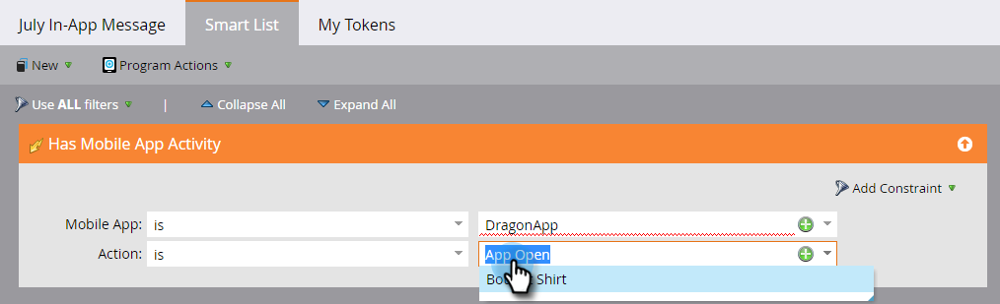

# 인앱 메시지 대상 {#set-your-in-app-message-audience} 설정

첫 번째 단계는 인앱 메시지를 받을 사람을 결정하는 것입니다. 스마트 목록을 설정해야 합니다.

1. **스마트 목록 편집**&#x200B;을 클릭합니다.

   

1. 스마트 목록에서 모바일 앱 활동이 있음 트리거가 자동으로 채워집니다. 드롭다운을 클릭하고 메시지를 삽입할 앱을 선택합니다.

   

   >[!NOTE]
   >
   >모바일 앱 필드에 대한 여러 값이 현재 인앱 메시지 프로그램에 대해 지원되지 않습니다.

1. **App** Open은 기본 작업 설정이지만 이미 설정한 사용자 지정 이벤트를 선택할 수 있습니다.

   

   >[!NOTE]
   >
   >개발자가 코드에 추가한 기본 트리거(App Open) 및 사용자 정의 트리거는 작업 선택기에 자동으로 표시됩니다. 사용자 지정 이벤트가 없는 경우 개발자에게 문의하여 앱에 사용자 지정 이벤트를 추가했는지 확인하십시오. 사용자 지정 이벤트 코딩 및 승인 프로세스를 완료하는 데 시간이 걸릴 수 있습니다. 자세한 내용은 [이 아티클](/help/marketo/product-docs/mobile-marketing/admin/before-you-create-push-notifications-and-in-app-messages.md)을 참조하십시오.

1. 필요한 경우 **모바일 앱 활동 포함** 트리거에 제약 조건을 사용할 수 있습니다.

   

1. 스마트 목록에 필터를 추가하여 인앱 메시지를 받는 사람을 제한할 수 있습니다. 이 예에서 **획득 날짜** 필터를 사용하면 2016년 6월 9일에 취득한 사람만 인앱 메시지가 전송됩니다.

   

1. 인앱 메시지 Campaign 컨트롤 패널으로 돌아갑니다. 드롭다운에서 표시 제한을 설정합니다.

   

   >[!NOTE]
   >
   >기본 표시 제한은 **세션당 한 번**&#x200B;입니다. 받는 사람이 응답한 후 메시지가 표시되지 않도록 하려면 **을 탭할 때까지 [매번]**&#x200B;을 선택합니다. 수신자가 수행하는 작업과 관계없이 항상 표시되어야 하는 경우 **항상**&#x200B;을 선택합니다.

   

잘했어! 고객층을 확보했습니다. 파란색 막대와 녹색 체크 표시를 받았습니다.

[인앱 메시지 선택 시간](/help/marketo/product-docs/mobile-marketing/in-app-messages/sending-your-in-app-message/select-your-in-app-message.md)!
