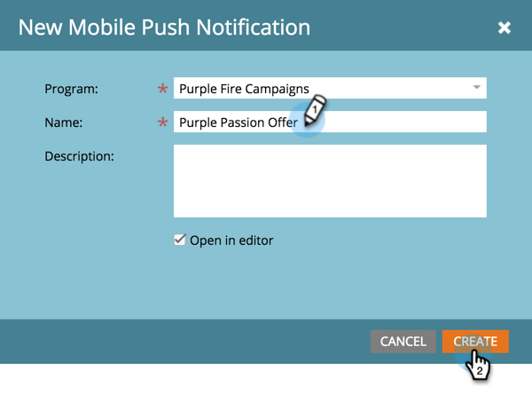

# 푸시 알림 만들기 {#create-a-push-notification}

푸시 알림을 손쉽게 만들 수 있습니다. 그러나 시작하기 전에 Marketing To Admin 및 Mobile Apps Developer에서 수행해야 할 몇 가지 사항을 설정해야 합니다. 자세한 [내용은 푸시 알림](understanding-push-notifications.md) 이해를 참조하십시오.

1. 마케팅 활동 **영역으로** 이동합니다.

   

1. 프로그램을 찾아 선택합니다.

   

1. 새로 **만들기**&#x200B;아래에서 **새 로컬 자산을 클릭합니다**.

   

1. 푸시 **알림을 선택합니다**.

   

1. 푸시 **알림 이름을** 입력하고 만들기를 **클릭합니다**.

   

   달콤해 푸시 알림이 생성되었으므로 이제 [정리해 보겠습니다](configure-mobile-push-notification.md).

