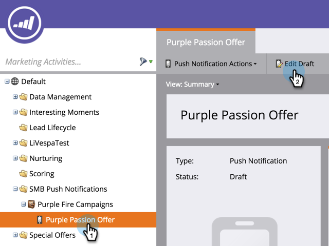

# 모바일 푸시 알림 편집 {#edit-mobile-push-notification}

1. **[!UICONTROL Marketing Activities]** 영역으로 이동합니다.

1. 모바일 앱을 선택하고 **[!UICONTROL Edit Draft]**&#x200B;을(를) 클릭합니다.

   

>[!MORELIKETHIS]
>
>여기에서 [푸시 알림 구성](/help/marketo/product-docs/mobile-marketing/push-notifications/configure-mobile-push-notification.md)에 대해 자세히 알아보세요.
