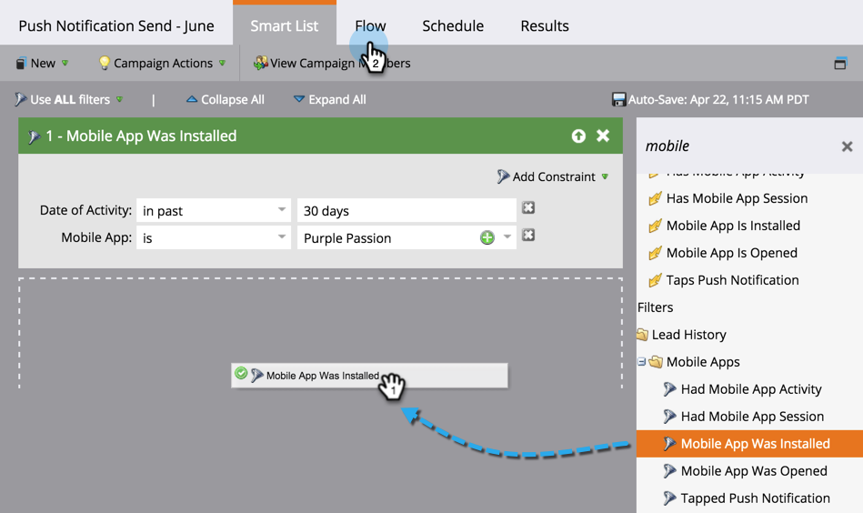

# 모바일 푸시 알림 보내기 {#send-a-mobile-push-notification}

모바일 앱을 사용하여 사람들에게 푸시 알림을 보냅니다.

>[!PREREQUISITES]
>
>* [새 스마트 캠페인 만들기](/help/marketo/product-docs/core-marketo-concepts/smart-campaigns/creating-a-smart-campaign/create-a-new-smart-campaign.md)
>* [푸시 알림 만들기](/help/marketo/product-docs/mobile-marketing/push-notifications/create-a-push-notification.md)

1. **[!UICONTROL Marketing Activities]** 영역으로 이동합니다.

   

1. 스마트 캠페인을 선택하고 **[!UICONTROL Smart List]**&#x200B;을(를) 클릭합니다.

   

1. 스마트 목록을 정의한 다음 **[!UICONTROL Flow]**&#x200B;을(를) 클릭합니다.

   

1. 푸시 알림을 선택합니다. **[!UICONTROL Schedule]**&#x200B;을(를) 클릭합니다.

   

   >[!NOTE]
   >
   >푸시 알림은 드롭다운에 표시되기 전에 승인되어야 합니다.

1. **[!UICONTROL Run Once]**&#x200B;을(를) 클릭합니다.

   

1. 날짜 및 시간을 선택합니다. **[!UICONTROL Save]**&#x200B;을(를) 클릭합니다.

   

푸시 알림이 나갈 때까지 기다립니다.
