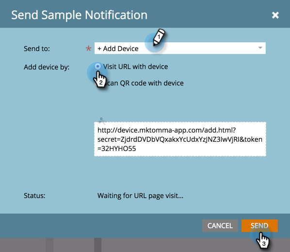

# 푸시 알림 샘플 보내기 {#send-a-push-notification-sample}

샘플을 보내 푸시 알림이 올바르게 작동하는지 확인할 수 있습니다.

>[!PREREQUISITES]
>
>샘플을 보낼 장치에 앱이 설치되어 있는지 확인합니다.

1. 다음 세 가지 방법으로 샘플을 보낼 수 있습니다.

   왼쪽의 트리에서 푸시 알림 자산을 마우스 오른쪽 단추로 클릭하고 **[!UICONTROL Send Sample]**&#x200B;을(를) 클릭합니다.

   

   또는 푸시 알림 작업 메뉴에서 **[!UICONTROL Send Sample]**&#x200B;을(를) 클릭합니다.

   

   또는 푸시 알림 편집기에서 **[!UICONTROL Send Sample]**&#x200B;을(를) 클릭합니다.

   

1. 사용할 테스트 장치를 이미 설정한 경우에는 목록에서 선택하십시오.

   

   또는 **[!UICONTROL Add Device]**&#x200B;을(를) 클릭하여 [새 테스트 장치를 추가](/help/marketo/product-docs/mobile-marketing/push-notifications/adding-a-new-test-device.md)하여 샘플을 보낼 수 있습니다.

   

1. 장치를 앱에 연결하는 방법에는 두 가지가 있습니다.

   첫 번째 옵션을 사용하여 **[!UICONTROL Visit URL with device]** 단추를 클릭하고 필드의 URL을 복사하여 전자 메일 또는 문자 메시지로 장치에 보냅니다. 장치에서 URL을 탭합니다. 상태에 연결이 표시되면 **[!UICONTROL Send]**&#x200B;을(를) 클릭합니다.

   

   또는 두 번째 옵션을 사용하여 **[!UICONTROL Scan QR code with device]** 단추를 클릭하고 장치로 QR 코드를 스캔합니다. 상태에 연결이 표시되면 **[!UICONTROL Send]**&#x200B;을(를) 클릭합니다.

   

   >[!TIP]
   >
   >테스트 장치를 추가했지만 **[!UICONTROL Send to]** 필드에 나열되지 않습니까? 문제를 해결하려면 다음을 확인하십시오.
   >
   >* 푸시 알림과 연계된 앱에 대해 푸시 알림이 켜집니다.
   >
   >* 푸시 알림은 테스트 장치의 플랫폼에 대해 구성됩니다. 예를 들어, iPhone을 테스트 장치로 추가한 경우 iOS에 대해 푸시 알림이 활성화되어 있는지 확인합니다.

진정해!
