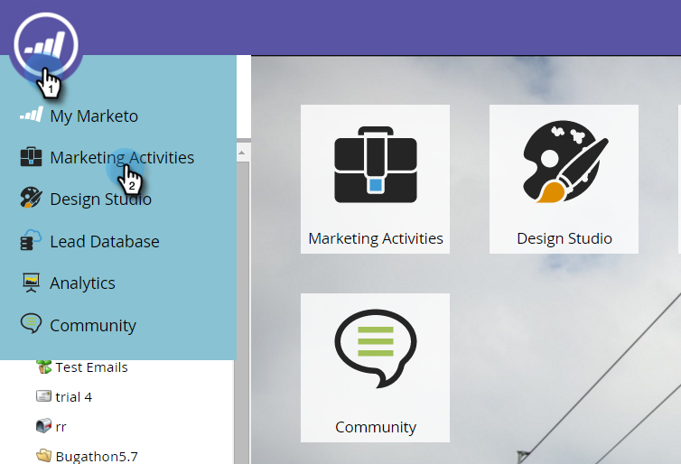

# 푸시 알림 대시보드 {#view-the-push-notification-dashboard} 보기

푸시 알림의 작동 방식을 손쉽게 확인할 수 있습니다.

1. **마케팅 활동** 영역으로 이동합니다.

   

1. 캠페인을 선택합니다.

   

1. **보기:요약**&#x200B;을(를) 선택하고 **대시보드**&#x200B;를 선택합니다.

   

1. 서클 그래프로 iOS 및 Android에 대한 총 전송 및 총 탭을 볼 수 있습니다. 아래로 스크롤하여 막대 그래프에서 [감소]를 확인합니다.

   

   >[!NOTE]
   >
   >**Sent** 지표는 푸시 알림을 전송한 정확한 사람 수보다 많은 전송을 반영할 수 있습니다. 푸시를 받을 수 있는 *개 장치 수*&#x200B;에 따라 계산되기 때문입니다. 예를 들어, 한 사람에게 3개의 장치가 있는 경우 대시보드는 하나가 아닌 3개의 전송을 등록합니다.

   >[!NOTE]
   >
   >**관련 문서**
   >
   >    
   >    
   >    * [푸시 알림 이해](understanding-push-notifications.md)
   >    * [모바일 푸시 알림 보내기](send-a-mobile-push-notification.md)

