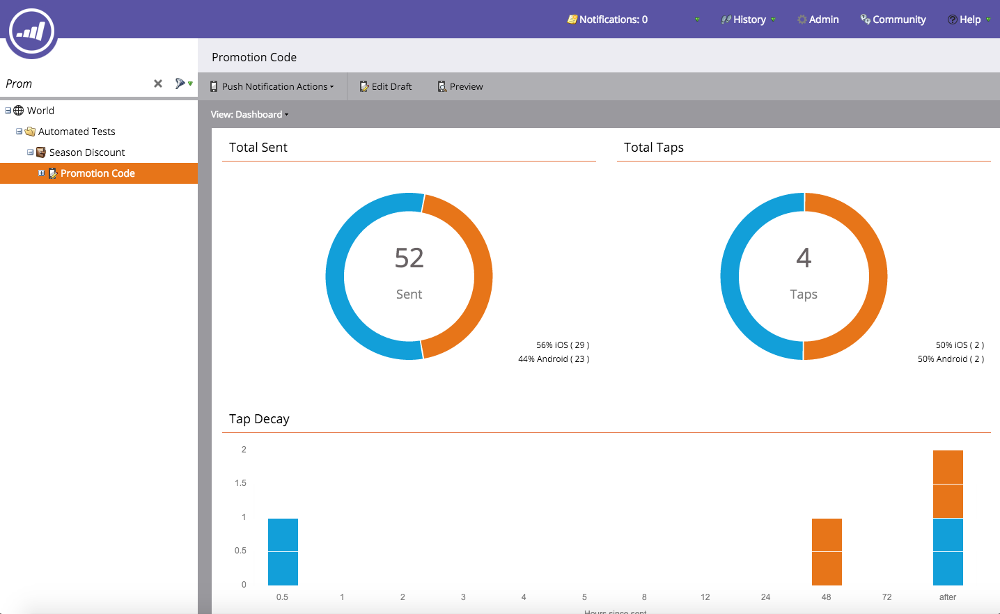

# 푸시 알림 대시보드 보기 {#view-the-push-notification-dashboard}

푸시 알림의 작동 방식을 쉽게 확인할 수 있습니다.

1. **[!UICONTROL Marketing Activities]** 영역으로 이동합니다.

   

1. 캠페인을 선택합니다.

   

1. **[!UICONTROL View: Summary]**&#x200B;을(를) 클릭하고 **[!UICONTROL Dashboard]**&#x200B;을(를) 선택합니다.

   

1. 원 그래프에서 iOS 및 Android의 [!UICONTROL Total Sent] 및 [!UICONTROL Total Taps]을(를) 볼 수 있습니다. 아래로 스크롤하여 막대 그래프로 [!UICONTROL Tap Decay]을(를) 봅니다.

   

   >[!NOTE]
   >
   >_전송됨_ 지표는 푸시 알림을 전송한 정확한 사용자 수보다 많은 전송을 반영할 수 있습니다. 이는 푸시를 받을 자격이 있는 _장치 수_&#x200B;을(를) 기반으로 계산되기 때문입니다. 예를 들어 한 사람이 세 개의 장치를 가지고 있다면 대시보드는 하나가 아니라 세 개의 전송을 등록합니다.

   >[!MORELIKETHIS]
   >
   >* [푸시 알림 이해](/help/marketo/product-docs/mobile-marketing/push-notifications/understanding-push-notifications.md)
   >* [모바일 푸시 알림 보내기](/help/marketo/product-docs/mobile-marketing/push-notifications/send-a-mobile-push-notification.md)
