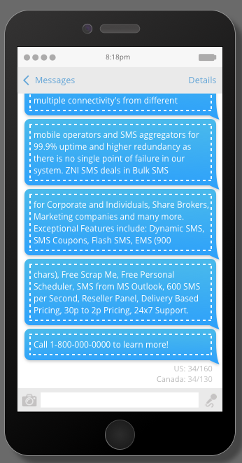

# Vibes SMS 메시지 만들기 {#create-a-vibes-sms-message}

Vibes SMS 메시지를 만드는 방법을 설명합니다.

1. 마케팅 활동으로 이동하고 프로그램을 마우스 오른쪽 단추로 클릭합니다.

   

1. 새 **로컬 자산을 클릭합니다**.

   

   >[!TIP]
   >
   >또는 **새로 만들기** 드롭다운을 클릭할 수 있습니다.

1. SMS **메시지를 클릭합니다**.

   

1. 새 SMS 메시지의 이름과 선택적 설명을 입력하고 [만들기]를 **클릭합니다**.

   

1. 초안 **편집을 클릭합니다**.

   

1. 메시지 편집기에서 파란색 풍선 내부를 클릭하고 텍스트를 입력하기 시작합니다.

   

   >[!NOTE]
   >
   >미국과 캐나다의 제한은 각각 160자 및 130자로 다릅니다. 문자 제한을 초과하면 메시지가 분할될 수 있습니다. 캐나다 제한을 초과할 때 표시되는 반면 편집기는 미국 제한에 따라 미국에 최적화되어 메시지를 분할합니다.

1. 삽입 **메뉴에서** 토큰을 클릭하여 메시지에 토큰을 추가합니다.

   

   >[!NOTE]
   >
   >토큰을 추가하면 메시지가 문자 제한을 초과할 수 있습니다. 그러면 메시지가 분할되어 추가 비용이 발생합니다.

1. 삽입 **메뉴에서** 링크를 클릭하여 메시지에 링크를 추가합니다.

   

1. 링크 유형을 선택합니다. 마케팅 랜딩 페이지가 기본값입니다. 그런 다음 드롭다운에서 랜딩 페이지를 선택하고 삽입을 **클릭합니다**.

   

   >[!NOTE]
   >
   >기본적으로 두 개의 추적 링크가 선택됩니다.

1. 외부 URL을 대신 사용하려면 [ **외부 URL** ] 단추를 클릭하고 URL 필드에 URL을 입력합니다. 삽입을 **클릭합니다**.

   

1. 링크가 메시지에 표시됩니다.

   

   >[!NOTE]
   >
   >Marketing에 브랜드 추적 도메인의 링크 미리 보기가 표시됩니다. mkt_tok 링크 확인란을 선택 해제하면 링크가 변경됩니다. 링크 추적 확인란을 선택 취소하면 URL이 기본 길이(예: www.mygooglepage.com)으로 단축됩니다.

   

   >[!NOTE]
   >
   >문자 수는 가장 낮은 메시지에 포함된 문자만 반영합니다.

미국 제한보다 많은 값을 삽입하면 편집기가 메시지를 섹션으로 분할합니다. 절대 합계 길이는 900자입니다. 이 제한에 도달하면 메시지가 대상자에게 전송될 때 자동으로 잘립니다.