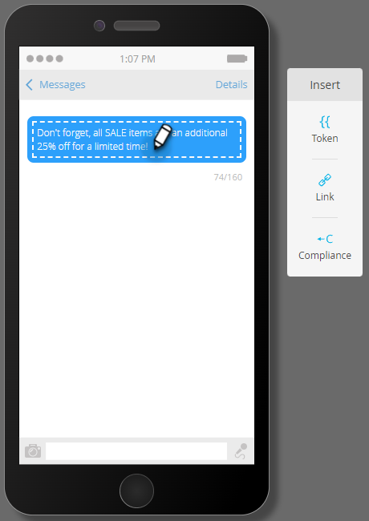

# SMS 메시지 만들기 {#create-an-sms-message}

SMS 메시지를 만드는 방법은 다음과 같습니다.

>[!AVAILABILITY]
>
>이 기능은 Adobe Marketo Engage 계정의 추가 기능으로 사용할 수 있습니다. 제대로 프로비저닝되려면 Adobe을 통해 구매해야 합니다. 자세한 내용은 Adobe 계정 팀(계정 관리자)에 문의하십시오. Marketo Vibes SMS 기본 통합은 미국 및 캐나다에서 사용할 수 있습니다. 다른 국가의 경우 [Vibes에 직접 연결](https://www.vibes.com/talk-to-sales)하여 Marketo Webhooks를 통한 연결을 이용할 수 있습니다.

>[!PREREQUISITES]
>
>[LaunchPoint 서비스로 비디오 추가](/help/marketo/product-docs/mobile-marketing/admin/add-vibes-as-a-launchpoint-service.md){target="_blank"}

1. **[!UICONTROL 마케팅 활동]**(으)로 이동합니다.

   

1. 원하는 프로그램을 마우스 오른쪽 단추로 클릭하고 **[!UICONTROL 새 로컬 자산]**&#x200B;을 선택합니다.

   

1. **SMS 메시지**&#x200B;를 선택합니다.

   

1. 새 SMS 메시지의 이름과 선택적 설명을 입력하고 **만들기**&#x200B;를 클릭합니다.

   

1. 편집기에서 파란색 버블 내부를 클릭하고 텍스트 입력을 시작합니다.

   

   >[!NOTE]
   >
   >SMS 메시지의 문자 제한은 표준 ASCII 문자 집합을 사용하는 160자입니다. 160자를 초과하면 메시지가 총 문자 수에 따라 분할됩니다.

1. 메시지에 토큰을 추가하려면 빠른 인사말을 작성하고 **토큰**&#x200B;을 클릭하세요.

   

   >[!NOTE]
   >
   >토큰을 추가하면 메시지가 문자 제한을 초과할 수 있습니다. 그러면 메시지가 분할되어 추가 메시지가 생성됩니다.

   >[!IMPORTANT]
   >
   >SMS 준수: 모든 아웃바운드 SMS 메시지에는 브랜드 이름 또는 프로그램 설명이 포함되어야 합니다. 도움말 및 중지 지침은 반복 메시지 프로그램의 경우 구독자당 매월 1회 이상 제공되어야 합니다.

1. 원하는 **토큰**&#x200B;을(를) 선택하고 선택적 **기본값**&#x200B;을(를) 입력한 다음 **만들기**&#x200B;를 클릭합니다.

   

1. 링크를 추가하려면 메시지에서 표시할 위치를 선택하고 **링크**&#x200B;를 클릭합니다.

   

1. 링크 유형을 선택합니다. Marketo 랜딩 페이지가 기본값입니다. 해당 페이지로 이동하면 랜딩 페이지 드롭다운을 클릭하고 원하는 페이지를 선택합니다. 완료되면 **삽입**&#x200B;을 클릭하세요.

   

   >[!NOTE]
   >
   >기본적으로 두 개의 추적 링크가 선택되어 있습니다. mkt_tok 포함만 선택을 취소해도 링크가 계속 추적될 수 있지만, 리디렉션 후 대상 URL에는 mkt_tok 쿼리 문자열 매개 변수가 포함되지 않습니다. 이 매개 변수는 Marketo 랜딩 페이지 및 Munchkin에서 개인 활동(예: 개인이 옵트아웃한 경우)을 적절히 추적하는 데 사용됩니다.

1. 외부 URL을 대신 사용하려면 **외부 URL**&#x200B;을 선택하고 URL을 입력/붙여 넣은 다음 **삽입**&#x200B;을 클릭하세요.

   

   >[!NOTE]
   >
   >&quot;추적 링크&quot;를 선택한 상태로 두면 Marketo은 추적을 위해 URL을 자동으로 수정합니다. 추적을 비활성화하도록 선택하면 URL이 변경되지 않은 상태로 메시지에 표시됩니다(예: `www.adobe.com`).

   >[!CAUTION]
   >
   >통신사가 메시지를 스팸으로 표시할 수 있으므로 _사용하지 않는_&#x200B;것이 좋습니다(예: Bitly).

1. 링크가 메시지에 표시됩니다.

   

   >[!NOTE]
   >
   >Marketo에 브랜드 추적 도메인의 링크 미리보기가 표시됩니다. mkt_tok 링크 확인란의 선택을 취소하면 링크가 변경됩니다.

160자 이상을 삽입하는 경우 편집기는 SMS를 섹션으로 나눕니다. 메시지당 전체 길이는 900자로 제한됩니다. 이를 초과하는 경우 게재 시 메시지가 잘립니다.
